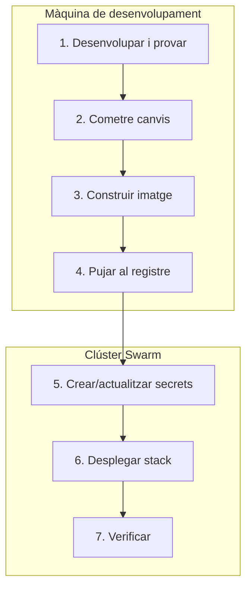
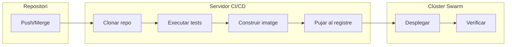

Fins ara hem executat les comandes de Docker Swarm manualment: crear secrets, configurar serveis, desplegar stacks. En aquest tema automatitzarem el procés per garantir desplegaments consistents, repetibles i lliures d'errors humans.

## Estructura de projecte

Abans d'automatitzar, convé organitzar el projecte de manera que faciliti el desplegament. Aquesta és l'estructura que hem anat construint al llarg dels temes anteriors:

```
myapp/
├── src/                                   # Codi font de l'aplicació
│   └── ...
├── docker/
│   ├── app/
│   │   └── Dockerfile                     # Imatge de l'aplicació
│   └── traefik/
│       ├── traefik.development.yml        # Configuració per a desenvolupament
│       └── traefik.production.yml         # Configuració per a producció
├── deploy/
│   ├── deploy.sh                          # Script principal de desplegament
│   └── manage-secrets.sh                  # Script per gestionar secrets
├── docker-compose.yml                     # Desenvolupament local
├── docker-stack.yml                       # Producció amb Swarm
├── .env.example                           # Plantilla de variables d'entorn
├── .env                                   # Variables locals (NO cometre)
├── .env.production                        # Variables de producció (NO cometre)
└── .gitignore
```

El fitxer `.gitignore` ha d'excloure tots els fitxers amb credencials:

```gitignore
# Variables d'entorn amb valors reals
.env
.env.production
.env.staging

# Mantenim només l'exemple
!.env.example

# Claus i certificats
*.pem
*.key
```

## Gestió automatitzada de secrets

Al tema anterior vam veure com crear secrets manualment. Quan tenim diverses variables sensibles, això és propens a errors. L'script següent automatitza el procés llegint un fitxer `.env.production`.

### Fitxer `.env.production`

Aquest fitxer conté els valors reals per a producció. Mai s'ha de cometre al repositori:

```bash
# Secrets (credencials i dades sensibles)
SECRET_KEY=una-clau-molt-segura-generada-aleatoriament
POSTGRES_USER=myapp
POSTGRES_PASSWORD=una-contrasenya-molt-segura
```

### Script `manage-secrets.sh`

```bash
#!/bin/bash
#
# Gestiona secrets de Docker Swarm a partir d'un fitxer .env
#
# Ús:
#   ./manage-secrets.sh [create|remove] [fitxer_env] [nom_stack]
#
# Exemples:
#   ./manage-secrets.sh create .env.production myapp
#   ./manage-secrets.sh remove .env.production myapp
#

set -euo pipefail

# === CONFIGURACIÓ ===
# Definim quines variables són secrets
SECRETS=(
    "SECRET_KEY"
    "POSTGRES_USER"
    "POSTGRES_PASSWORD"
)

# === FUNCIONS ===

show_usage() {
    echo "Ús: $0 [create|remove] [fitxer_env] [nom_stack]"
    echo ""
    echo "Comandes:"
    echo "  create    Crea secrets al clúster"
    echo "  remove    Elimina secrets del clúster"
    echo ""
    echo "Exemples:"
    echo "  $0 create .env.production myapp"
    echo "  $0 remove .env.production myapp"
    exit 1
}

create_secrets() {
    local env_file="$1"
    local stack_name="$2"

    # Comprova que el fitxer existeix
    if [[ ! -f "$env_file" ]]; then
        echo "Error: No s'ha trobat el fitxer $env_file"
        exit 1
    fi

    # Carrega les variables del fitxer
    set -a
    source "$env_file"
    set +a

    echo "=== Creant secrets ==="
    local created=0
    local skipped=0

    for name in "${SECRETS[@]}"; do
        value="${!name:-}"
        if [[ -z "$value" ]]; then
            echo "  Avís: $name no té valor, s'omet"
            ((skipped++))
            continue
        fi

        # Nom del secret en minúscules
        secret_name="${name,,}"

        # Comprova si ja existeix
        if docker secret inspect "$secret_name" &>/dev/null; then
            echo "  Ja existeix: $secret_name (s'omet)"
            ((skipped++))
        else
            echo "  Creant: $secret_name"
            echo "$value" | docker secret create "$secret_name" -
            ((created++))
        fi
    done

    echo ""
    echo "=== Resum ==="
    echo "Secrets creats: $created"
    echo "Secrets omesos: $skipped"
}

remove_secrets() {
    local env_file="$1"
    local stack_name="$2"

    echo "=== Eliminant secrets ==="
    local removed=0
    local errors=0

    for name in "${SECRETS[@]}"; do
        secret_name="${name,,}"
        if docker secret inspect "$secret_name" &>/dev/null; then
            echo "  Eliminant: $secret_name"
            if docker secret rm "$secret_name" 2>/dev/null; then
                ((removed++))
            else
                echo "    Error: No s'ha pogut eliminar (pot estar en ús)"
                ((errors++))
            fi
        fi
    done

    echo ""
    echo "=== Resum ==="
    echo "Secrets eliminats: $removed"
    if [[ $errors -gt 0 ]]; then
        echo "Errors: $errors (executa 'docker stack rm $stack_name' primer)"
    fi
}

# === MAIN ===

ACTION="${1:-}"
ENV_FILE="${2:-.env.production}"
STACK_NAME="${3:-myapp}"

case "$ACTION" in
    create)
        create_secrets "$ENV_FILE" "$STACK_NAME"
        ;;
    remove)
        remove_secrets "$ENV_FILE" "$STACK_NAME"
        ;;
    *)
        show_usage
        ;;
esac
```

### Ús de l'script

```bash
# Fer l'script executable
chmod +x deploy/manage-secrets.sh

# Preparar el fitxer de producció
cp .env.example .env.production
nano .env.production  # Editar amb els valors reals

# Crear secrets
./deploy/manage-secrets.sh create .env.production myapp

# Verificar
docker secret ls

# Eliminar (quan calgui, després de docker stack rm)
./deploy/manage-secrets.sh remove .env.production myapp
```

L'script no sobreescriu secrets existents. Si necessites actualitzar un secret, primer has d'eliminar l'stack i el secret antic, com vam veure al tema anterior.

## Versionat d'imatges

Un aspecte crític del desplegament és identificar quina versió de l'aplicació s'està executant.

### Estratègies d'etiquetes

| Estratègia | Exemple | Avantatges | Inconvenients |
|:-----------|:--------|:-----------|:--------------|
| `latest` | `myapp:latest` | Simple | No saps quina versió s'executa |
| Versió semàntica | `myapp:1.2.3` | Clara, immutable | Cal mantenir versions manualment |
| Hash de commit | `myapp:a1b2c3d` | Traçabilitat exacta | Poc llegible |
| Data | `myapp:20260211` | Ordenació temporal | Pot haver-hi múltiples deploys/dia |
| Combinada | `myapp:1.2.3-a1b2c3d` | Llegible i traçable | Més llarga |

La recomanació és usar versió semàntica per a releases formals i hash de commit per a desplegaments continus durant el desenvolupament.

### Generar l'etiqueta automàticament

```bash
# Obtenir el tag de versió si existeix, sinó el hash curt del commit
get_version() {
    git describe --tags --exact-match 2>/dev/null || git rev-parse --short HEAD
}

VERSION=$(get_version)

# Construir i pujar la imatge
docker build -t myuser/myapp:$VERSION -f docker/app/Dockerfile .
docker push myuser/myapp:$VERSION
```

## Pipeline de desplegament

Un pipeline de desplegament és la seqüència de passos que s'executen per portar el codi des del repositori fins a producció.

### Flux de treball local

Quan treballem amb un clúster local o remot sense CI/CD, el flux típic és:



Els passos en detall:

1. **Desenvolupar i provar**: `docker compose up`
2. **Cometre canvis**: `git add . && git commit && git push`
3. **Construir imatge**: `docker build -t myuser/myapp:$VERSION .`
4. **Pujar al registre**: `docker push myuser/myapp:$VERSION`
5. **Crear secrets** (només el primer cop): `./manage-secrets.sh create`
6. **Desplegar stack**: `docker stack deploy -c docker-stack.yml myapp`
7. **Verificar**: `docker stack services myapp`

### Flux de treball amb CI/CD

En un entorn professional, el flux s'automatitza amb eines de CI/CD (GitHub Actions, GitLab CI, Gitea Actions, etc.). Els passos s'executen automàticament en resposta a events del repositori:



**Diferències clau:**

| Aspecte | Flux local | Flux CI/CD |
|:--------|:-----------|:-----------|
| Execució | Manual | Automàtica per push/merge |
| Entorn | Màquina del desenvolupador | Servidor dedicat |
| Credencials | Fitxer `.env.production` | Variables secretes del CI/CD |
| Accés al clúster | SSH directe | Clau SSH del CI/CD |
| Tests | Opcionals | Obligatoris abans de desplegar |
| Rollback | Manual | Pot ser automàtic |

## Script de desplegament

Aquest script unifica tots els passos del flux local en una sola comanda:

```bash
#!/bin/bash
#
# Script de desplegament per a Docker Swarm
#
# Ús:
#   ./deploy.sh [versió]
#
# Exemples:
#   ./deploy.sh              # Usa el hash del commit actual
#   ./deploy.sh 1.2.3        # Usa la versió especificada
#

set -euo pipefail

# === CONFIGURACIÓ ===
REGISTRY="myuser"                    # Usuari de Docker Hub (o URL del registre)
IMAGE_NAME="myapp"
STACK_NAME="myapp"
STACK_FILE="docker-stack.yml"
DOCKERFILE="docker/app/Dockerfile"
ENV_FILE=".env.production"
MANAGER_HOST="root@185.12.64.10"     # Usuari i IP del node manager

# === FUNCIONS ===

log() {
    echo "[$(date '+%Y-%m-%d %H:%M:%S')] $*"
}

error() {
    log "ERROR: $*" >&2
    exit 1
}

get_version() {
    if [[ -n "${1:-}" ]]; then
        echo "$1"
    else
        git describe --tags --exact-match 2>/dev/null || git rev-parse --short HEAD
    fi
}

check_prerequisites() {
    log "Comprovant prerequisits..."
    
    # Comprovar que estem en un repo git
    git rev-parse --git-dir > /dev/null 2>&1 || error "No és un repositori git"
    
    # Comprovar que no hi ha canvis sense cometre
    if [[ -n $(git status --porcelain) ]]; then
        error "Hi ha canvis sense cometre. Fes commit primer."
    fi
    
    # Comprovar que existeix el fitxer stack
    [[ -f "$STACK_FILE" ]] || error "No s'ha trobat $STACK_FILE"
    
    # Comprovar que existeix el Dockerfile
    [[ -f "$DOCKERFILE" ]] || error "No s'ha trobat $DOCKERFILE"
    
    # Comprovar connexió SSH al manager
    ssh -o ConnectTimeout=5 "$MANAGER_HOST" "docker info" > /dev/null 2>&1 \
        || error "No es pot connectar a $MANAGER_HOST"
    
    log "Prerequisits correctes"
}

build_and_push() {
    local version="$1"
    local full_image="$REGISTRY/$IMAGE_NAME:$version"
    
    log "Construint imatge: $full_image"
    docker build -t "$full_image" -f "$DOCKERFILE" .
    
    log "Pujant imatge al registre..."
    docker push "$full_image"
    
    log "Imatge pujada correctament"
}

deploy_to_swarm() {
    local version="$1"
    
    log "Desplegant al clúster..."
    
    # Usar DOCKER_HOST per executar comandes remotament
    export DOCKER_HOST="ssh://$MANAGER_HOST"
    
    log "Desplegant stack amb versió $version..."
    VERSION="$version" docker stack deploy -c "$STACK_FILE" "$STACK_NAME"
    
    log "Esperant que els serveis estiguin llestos..."
    sleep 10
    
    # Restaurar DOCKER_HOST
    unset DOCKER_HOST
}

verify_deployment() {
    log "Verificant desplegament..."
    
    export DOCKER_HOST="ssh://$MANAGER_HOST"
    
    # Mostrar estat dels serveis
    echo ""
    docker stack services "$STACK_NAME"
    echo ""
    
    # Comprovar que tots els serveis tenen les rèpliques desitjades
    local all_ok=true
    while IFS= read -r line; do
        local name replicas actual desired
        name=$(echo "$line" | awk '{print $1}')
        replicas=$(echo "$line" | awk '{print $2}')
        actual=$(echo "$replicas" | cut -d'/' -f1)
        desired=$(echo "$replicas" | cut -d'/' -f2)
        
        if [[ "$actual" != "$desired" ]]; then
            log "AVÍS: $name té $actual/$desired rèpliques"
            all_ok=false
        fi
    done < <(docker stack services "$STACK_NAME" --format "{{.Name}} {{.Replicas}}")
    
    unset DOCKER_HOST
    
    if [[ "$all_ok" == "true" ]]; then
        log "Tots els serveis estan correctes"
    else
        log "Alguns serveis encara s'estan iniciant. Revisa amb:"
        log "  DOCKER_HOST=ssh://$MANAGER_HOST docker stack ps $STACK_NAME"
    fi
}

# === MAIN ===

main() {
    local version
    version=$(get_version "${1:-}")
    
    log "=========================================="
    log "Desplegament de $IMAGE_NAME:$version"
    log "=========================================="
    
    check_prerequisites
    build_and_push "$version"
    deploy_to_swarm "$version"
    verify_deployment
    
    log "=========================================="
    log "Desplegament completat: $IMAGE_NAME:$version"
    log "=========================================="
}

main "$@"
```

### Ús de l'script

```bash
# Fer l'script executable
chmod +x deploy/deploy.sh

# Desplegament amb versió automàtica (hash del commit)
./deploy/deploy.sh

# Desplegament amb versió específica
./deploy/deploy.sh 1.2.3
```

Sortida esperada:

```
[2026-02-18 10:30:00] ==========================================
[2026-02-18 10:30:00] Desplegament de myapp:a1b2c3d
[2026-02-18 10:30:00] ==========================================
[2026-02-18 10:30:00] Comprovant prerequisits...
[2026-02-18 10:30:01] Prerequisits correctes
[2026-02-18 10:30:01] Construint imatge: myuser/myapp:a1b2c3d
[2026-02-18 10:30:45] Pujant imatge al registre...
[2026-02-18 10:31:20] Imatge pujada correctament
[2026-02-18 10:31:21] Desplegant al clúster...
[2026-02-18 10:31:25] Desplegant stack amb versió a1b2c3d...
[2026-02-18 10:31:30] Esperant que els serveis estiguin llestos...

ID             NAME              MODE         REPLICAS   IMAGE
abc123         myapp_traefik     replicated   1/1        traefik:v3.6
def456         myapp_postgres    replicated   1/1        postgres:18-alpine
ghi789         myapp_redis       replicated   1/1        redis:8.6-alpine
jkl012         myapp_web         replicated   3/3        myuser/myapp:a1b2c3d
mno345         myapp_worker      replicated   2/2        myuser/myapp:a1b2c3d
pqr678         myapp_beat        replicated   1/1        myuser/myapp:a1b2c3d

[2026-02-18 10:31:41] Verificant desplegament...
[2026-02-18 10:31:42] Tots els serveis estan correctes
[2026-02-18 10:31:42] ==========================================
[2026-02-18 10:31:42] Desplegament completat: myapp:a1b2c3d
[2026-02-18 10:31:42] ==========================================
```

## Consideracions de seguretat

### Accés SSH al clúster

L'script usa `DOCKER_HOST=ssh://...` per executar comandes Docker remotament. Això requereix:

1. Tenir accés SSH configurat amb claus (sense contrasenya).
2. Que l'usuari remot tingui permisos per executar Docker.

Per configurar l'accés:

```bash
# Generar clau SSH si no en tens
ssh-keygen -t ed25519 -C "deploy@myapp"

# Copiar la clau pública al manager
ssh-copy-id root@185.12.64.10

# Verificar l'accés
ssh root@185.12.64.10 "docker info"
```

### Variables del CI/CD

Els sistemes de CI/CD permeten definir variables secretes que no es mostren als logs:

| Variable | Contingut |
|:---------|:----------|
| `DOCKERHUB_USERNAME` | Usuari de Docker Hub |
| `DOCKERHUB_TOKEN` | Token d'accés de Docker Hub |
| `SSH_PRIVATE_KEY` | Clau privada per connectar al clúster |
| `SWARM_MANAGER_HOST` | Adreça del node manager |

Aquestes variables es passen a l'script de desplegament sense exposar-les al codi font ni als logs.

### Bones pràctiques

1. **No cometre mai credencials** al repositori.
2. **Usar claus SSH específiques** per al CI/CD amb permisos mínims.
3. **Rotar secrets periòdicament**, especialment després de canvis de personal.
4. **Revisar els logs** de desplegament per detectar anomalies.
5. **Mantenir còpies de seguretat** dels secrets en una bòveda segura.

## Resum

| Component | Funció |
|:----------|:-------|
| `.env.example` | Plantilla de variables (es comete al repo) |
| `.env.production` | Valors reals per a producció (NO es comete) |
| `manage-secrets.sh` | Crea secrets al clúster des del fitxer `.env.production` |
| `deploy.sh` | Construeix, puja i desplega en una sola comanda |
| `docker-stack.yml` | Definició de l'stack amb secrets externs |

**Flux de desplegament:**

1. Desenvolupar i provar localment amb `docker compose up`.
2. Cometre els canvis amb `git commit`.
3. Executar `./deploy/deploy.sh [versió]`.
4. L'script construeix, puja i desplega automàticament.
5. Verificar el resultat.

## Exercici pràctic

L'objectiu d'aquest exercici és crear un pipeline de desplegament automatitzat.

### Requisits

* Un clúster Docker Swarm amb almenys 2 nodes.
* Accés SSH configurat amb claus al node manager.
* Un compte a Docker Hub (o un registre alternatiu).
* Git instal·lat a la màquina de desenvolupament.

### Tasques

1. **Preparar els scripts**:
   * Crea el directori `deploy/` al teu projecte.
   * Copia l'script `manage-secrets.sh` i ajusta la llista `SECRETS`.
   * Copia l'script `deploy.sh` i ajusta les variables de configuració.
   * Fes els scripts executables amb `chmod +x deploy/*.sh`.

2. **Preparar la configuració**:
   * Crea el fitxer `.env.production` amb els valors reals.
   * Verifica que `.env.production` està al `.gitignore`.

3. **Primer desplegament**:
   * Connecta al manager i crea els secrets:
     ```bash
     scp .env.production root@185.12.64.10:
     ssh root@185.12.64.10
     ./manage-secrets.sh create .env.production myapp
     ```
   * Executa l'script de desplegament:
     ```bash
     ./deploy/deploy.sh
     ```
   * Verifica que l'aplicació funciona.

4. **Actualització**:
   * Modifica alguna cosa al codi.
   * Fes commit dels canvis.
   * Executa `./deploy/deploy.sh` de nou.
   * Verifica que el canvi s'ha aplicat.

5. **Desplegament amb versió**:
   * Crea un tag git: `git tag 1.0.0`.
   * Executa `./deploy/deploy.sh 1.0.0`.
   * Verifica que la imatge té l'etiqueta correcta al registre.

6. **Neteja** (opcional):
   * Elimina l'stack: `docker stack rm myapp`.
   * Elimina els secrets: `./deploy/manage-secrets.sh remove .env.production myapp`.