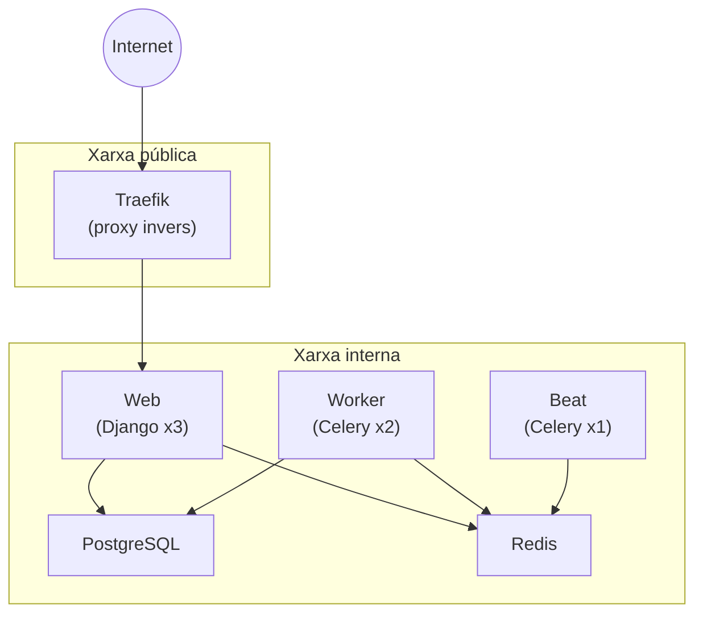

Aquest tema integra els conceptes vistos fins ara en un cas pràctic complet: el desplegament d'una aplicació web Django en un clúster Docker Swarm. L'exemple inclou molts dels components habituals d'una aplicació web moderna: proxy invers, base de dades, caché, cua de tasques i múltiples rèpliques de l'aplicació.

## Arquitectura

L'aplicació consta dels següents serveis:

| Servei   | Rèpliques | Mode                    | Funció                                    |
|:---------|:---------:|:------------------------|:------------------------------------------|
| traefik  | 1         | replicated              | Proxy invers i gestor de tràfic d'entrada |
| postgres | 1         | replicated (constraint) | Base de dades principal                   |
| redis    | 1         | replicated              | Sessions, caché i broker de Celery        |
| web      | 3         | replicated              | Aplicació Django amb Gunicorn             |
| worker   | 2         | replicated              | Workers de Celery                         |
| beat     | 1         | replicated              | Celery Beat per a tasques periòdiques     |


Celery Beat ha de tenir **exactament una rèplica**. Múltiples instàncies executarien les tasques periòdiques més d'una vegada.


El següent diagrama mostra la relació entre els serveis:



## Gestió de configuració

Quan el projecte Django usa un fitxer `.env` amb `django-environ` per carregar la configuració, cal adaptar l'enfocament per a Docker Swarm. L'estratègia recomanada és separar la configuració en tres categories:

| Categoria | Mecanisme | Exemple |
|:----------|:----------|:--------|
| Configuració no sensible | Variables d'entorn | `DEBUG`, `ALLOWED_HOSTS` |
| Fitxers de configuració | Docker Configs | Traefik, NGINX, etc. |
| Credencials | Docker Secrets | `SECRET_KEY`, `POSTGRES_PASSWORD` |

És important tenir clar com arriben les variables al contenidor i com s'accedeixen des de Python:

| Mecanisme | Definició (YAML) | Accés (Python) |
|:----------|:-----------------|:---------------|
| Variables d'entorn | `environment:` | `os.environ["VAR"]` o `env("VAR")` |
| Docker Configs | `configs:` | Llegint el fitxer `/run/configs/VAR` |
| Docker Secrets | `secrets:` | Llegint el fitxer `/run/secrets/VAR` |

### Adaptació del fitxer `settings.py`

El codi Python del fitxer `settings.py` s'ha d'adaptar per compatibilitzar l'entorn de desenvolupament (Docker Compose amb fitxer `.env`) i l'entorn de producció (Docker Swarm amb secrets):

```python
# settings.py
from pathlib import Path
import environ


# Directori base del projecte
BASE_DIR = Path(__file__).resolve().parent.parent

# Inicialització de django-environ
env = environ.Env()

# Llegir .env si existeix (entorn de desenvolupament)
env_file = BASE_DIR.parent / ".env"
if env_file.exists():
    environ.Env.read_env(env_file)


def get_secret(name):
    """Llegeix un secret de /run/secrets/ si existeix."""
    secret_path = Path(f"/run/secrets/{name}")
    if secret_path.exists():
        return secret_path.read_text().strip()
    return None


# === CONFIGURACIÓ GENERAL ===

SECRET_KEY = get_secret("SECRET_KEY") or env("SECRET_KEY")
DEBUG = env.bool("DEBUG")
ALLOWED_HOSTS = env.list("ALLOWED_HOSTS")


# === BASE DE DADES ===

DATABASES = {
    "default": {
        "ENGINE": "django.db.backends.postgresql",
        "HOST": env("POSTGRES_HOST"),
        "PORT": env.int("POSTGRES_PORT"),
        "NAME": env("POSTGRES_DB"),
        "USER": get_secret("POSTGRES_USER") or env("POSTGRES_USER"),
        "PASSWORD": get_secret("POSTGRES_PASSWORD") or env("POSTGRES_PASSWORD"),
    }
}


# === REDIS ===

REDIS_SESSIONS_URL = env("REDIS_SESSIONS_URL")
REDIS_CACHE_URL = env("REDIS_CACHE_URL")

SESSION_ENGINE = "django.contrib.sessions.backends.cache"
SESSION_CACHE_ALIAS = "sessions"

CACHES = {
    "default": {
        "BACKEND": "django.core.cache.backends.redis.RedisCache",
        "LOCATION": REDIS_CACHE_URL,
    },
    "sessions": {
        "BACKEND": "django.core.cache.backends.redis.RedisCache",
        "LOCATION": REDIS_SESSIONS_URL,
    },
}


# === CELERY ===

CELERY_BROKER_URL = env("CELERY_BROKER_URL")
CELERY_RESULT_BACKEND = env("CELERY_RESULT_BACKEND")
```

L'ordre `get_secret() or env()` permet que:

- A **desenvolupament**: no existeix `/run/secrets/`, es llegeix del fitxer `.env`.
- A **producció**: existeix `/run/secrets/`, es llegeix del fitxer i s'ignora la variable d'entorn.

### Fitxer `.env.example`

Al repositori hi haurà un fitxer `.env.example` amb valors per defecte apropiats per a desenvolupament. L'alumnat copiarà aquest fitxer a `.env` abans de construir l'entorn amb Docker Compose:

```bash
# ===========================================
# Django
# ===========================================
SECRET_KEY=dev-secret-key-change-in-production
DEBUG=true
ALLOWED_HOSTS=localhost,127.0.0.1

# ===========================================
# PostgreSQL
# ===========================================
POSTGRES_HOST=postgres
POSTGRES_PORT=5432
POSTGRES_DB=myapp
POSTGRES_USER=myapp
POSTGRES_PASSWORD=myapp

# ===========================================
# Redis
# Base de dades 0: Sessions
# Base de dades 1: Caché de dades
# Base de dades 2: Broker Celery (cua de tasques)
# Base de dades 3: Backend Celery (resultats)
# ===========================================
REDIS_SESSIONS_URL=redis://redis:6379/0
REDIS_CACHE_URL=redis://redis:6379/1
CELERY_BROKER_URL=redis://redis:6379/2
CELERY_RESULT_BACKEND=redis://redis:6379/3
```

El fitxer `.env` s'ha d'excloure del repositori afegint-lo al `.gitignore`:

```gitignore
.env
.env.production
!.env.example
```

## Fitxers de configuració

### Configuració de Traefik

Traefik actua com a proxy invers i gestor del tràfic d'entrada. La seva configuració es gestiona amb un Docker Config:

```yaml
# config/traefik.yml
api:
  dashboard: false

entryPoints:
  web:
    address: ":80"
  websecure:
    address: ":443"

providers:
  docker:
    endpoint: "unix:///var/run/docker.sock"
    swarmMode: true
    exposedByDefault: false
    network: myapp_public

# En producció, afegir configuració de certificats Let's Encrypt
# certificatesResolvers:
#   letsencrypt:
#     acme:
#       email: admin@example.com
#       storage: /letsencrypt/acme.json
#       httpChallenge:
#         entryPoint: web
```

## Fitxer stack

El fitxer `docker-stack.yml` defineix tots els serveis, xarxes, volums, configs i secrets:

```yaml
# docker-stack.yml

services:
  # === PROXY INVERS ===
  traefik:
    image: traefik:v3.0
    ports:
      - "80:80"
      - "443:443"
    volumes:
      - /var/run/docker.sock:/var/run/docker.sock:ro
    configs:
      - source: traefik_config
        target: /etc/traefik/traefik.yml
    networks:
      - public
    deploy:
      replicas: 1
      placement:
        constraints:
          - node.role == manager

  # === BASE DE DADES ===
  postgres:
    image: postgres:16-alpine
    environment:
      POSTGRES_DB: myapp
      POSTGRES_USER_FILE: /run/secrets/postgres_user
      POSTGRES_PASSWORD_FILE: /run/secrets/postgres_password
    secrets:
      - postgres_user
      - postgres_password
    volumes:
      - postgres_data:/var/lib/postgresql/data
    networks:
      - backend
    deploy:
      replicas: 1
      placement:
        constraints:
          - node.labels.db == true

  # === REDIS ===
  redis:
    image: redis:7-alpine
    command: redis-server --appendonly yes
    volumes:
      - redis_data:/data
    networks:
      - backend
    deploy:
      replicas: 1

  # === APLICACIÓ WEB ===
  web:
    image: registry.example.com/myapp:${VERSION:-latest}
    environment:
      - DEBUG=false
      - ALLOWED_HOSTS=example.com,www.example.com
      - POSTGRES_HOST=postgres
      - POSTGRES_PORT=5432
      - POSTGRES_DB=myapp
      - REDIS_SESSIONS_URL=redis://redis:6379/0
      - REDIS_CACHE_URL=redis://redis:6379/1
      - CELERY_BROKER_URL=redis://redis:6379/2
      - CELERY_RESULT_BACKEND=redis://redis:6379/3
    secrets:
      - source: secret_key
        target: /run/secrets/SECRET_KEY
      - source: postgres_user
        target: /run/secrets/POSTGRES_USER
      - source: postgres_password
        target: /run/secrets/POSTGRES_PASSWORD
    networks:
      - public
      - backend
    deploy:
      replicas: 3
      labels:
        - "traefik.enable=true"
        - "traefik.http.routers.web.rule=Host(`example.com`) || Host(`www.example.com`)"
        - "traefik.http.routers.web.entrypoints=websecure"
        - "traefik.http.services.web.loadbalancer.server.port=8000"
      update_config:
        parallelism: 1
        delay: 10s
        order: start-first
      resources:
        limits:
          cpus: '1'
          memory: 512M
        reservations:
          cpus: '0.25'
          memory: 128M

  # === CELERY WORKER ===
  worker:
    image: registry.example.com/myapp:${VERSION:-latest}
    command: celery -A myapp worker -l info
    environment:
      - POSTGRES_HOST=postgres
      - POSTGRES_PORT=5432
      - POSTGRES_DB=myapp
      - REDIS_SESSIONS_URL=redis://redis:6379/0
      - REDIS_CACHE_URL=redis://redis:6379/1
      - CELERY_BROKER_URL=redis://redis:6379/2
      - CELERY_RESULT_BACKEND=redis://redis:6379/3
    secrets:
      - source: secret_key
        target: /run/secrets/SECRET_KEY
      - source: postgres_user
        target: /run/secrets/POSTGRES_USER
      - source: postgres_password
        target: /run/secrets/POSTGRES_PASSWORD
    networks:
      - backend
    deploy:
      replicas: 2
      resources:
        limits:
          cpus: '0.5'
          memory: 256M

  # === CELERY BEAT ===
  beat:
    image: registry.example.com/myapp:${VERSION:-latest}
    command: celery -A myapp beat -l info
    environment:
      - CELERY_BROKER_URL=redis://redis:6379/2
      - CELERY_RESULT_BACKEND=redis://redis:6379/3
    secrets:
      - source: secret_key
        target: /run/secrets/SECRET_KEY
    networks:
      - backend
    deploy:
      replicas: 1  # IMPORTANT: Mai més d'1 rèplica
      resources:
        limits:
          cpus: '0.25'
          memory: 128M

# === XARXES ===
networks:
  public:
    driver: overlay
  backend:
    driver: overlay
    internal: true

# === VOLUMS ===
volumes:
  postgres_data:
  redis_data:

# === CONFIGS ===
configs:
  traefik_config:
    file: ./config/traefik.yml

# === SECRETS ===
secrets:
  secret_key:
    external: true
  postgres_user:
    external: true
  postgres_password:
    external: true
```

### Aspectes destacats

**Xarxes separades**

- `public`: connecta Traefik amb l'aplicació web. Accessible des de l'exterior.
- `backend`: connecta l'aplicació amb PostgreSQL i Redis. Marcada com a `internal: true` per impedir l'accés extern.

**Secrets externs**

Els secrets es marquen com a `external: true` perquè es crearan prèviament amb `docker secret create`. Això evita tenir fitxers amb credencials al repositori.

**Constraint per a PostgreSQL**

El servei `postgres` té un constraint `node.labels.db == true`. Això garanteix que la base de dades s'executi sempre al mateix node, on hi ha el volum amb les dades.

**Recursos limitats**

Cada servei té definits límits de CPU i memòria per evitar que un servei consumeixi tots els recursos del clúster.

## Desplegament

### Preparació del clúster

Abans del primer desplegament, cal preparar el clúster:

```bash
# Etiquetar el node que allotjarà la base de dades
docker node update --label-add db=true node1
```

### Crear els secrets

Els secrets s'han de crear abans de desplegar l'stack:

```bash
# Generar i crear el SECRET_KEY de Django
openssl rand -base64 50 | tr -d '/=+' | cut -c -50 | \
  docker secret create secret_key -

# Crear les credencials de PostgreSQL
echo "myapp" | docker secret create postgres_user -
openssl rand -base64 24 | tr -d '/=+' | cut -c -24 | \
  docker secret create postgres_password -
```

### Desplegar l'stack

```bash
# Desplegar amb la versió per defecte (latest)
docker stack deploy -c docker-stack.yml myapp

# O especificant una versió concreta
VERSION=1.2.3 docker stack deploy -c docker-stack.yml myapp
```

### Verificar el desplegament

```bash
# Veure l'estat dels serveis
docker stack services myapp

# Veure les tasques d'un servei concret
docker stack ps myapp

# Veure els logs de l'aplicació web
docker service logs myapp_web

# Veure els logs del worker de Celery
docker service logs myapp_worker
```

## Operacions habituals

### Escalar un servei

```bash
# Augmentar el nombre de rèpliques de l'aplicació web
docker service scale myapp_web=5

# Augmentar els workers de Celery
docker service scale myapp_worker=4
```

### Actualitzar l'aplicació

```bash
# Desplegar una nova versió
VERSION=1.3.0 docker stack deploy -c docker-stack.yml myapp
```

Swarm farà un rolling update segons la configuració definida a `update_config`.

### Rotar un secret

Els secrets són immutables. Per actualitzar-los cal crear un nou secret i actualitzar el servei:

```bash
# 1. Crear el nou secret
openssl rand -base64 24 | tr -d '/=+' | cut -c -24 | \
  docker secret create postgres_password_v2 -

# 2. Actualitzar la contrasenya a PostgreSQL
docker exec -it $(docker ps -q -f name=myapp_postgres) \
  psql -U myapp -c "ALTER USER myapp WITH PASSWORD 'nova-contrasenya';"

# 3. Actualitzar els serveis afectats
docker service update \
  --secret-rm postgres_password \
  --secret-add source=postgres_password_v2,target=/run/secrets/POSTGRES_PASSWORD \
  myapp_web

docker service update \
  --secret-rm postgres_password \
  --secret-add source=postgres_password_v2,target=/run/secrets/POSTGRES_PASSWORD \
  myapp_worker

# 4. Eliminar el secret antic
docker secret rm postgres_password
```

### Veure l'estat d'un desplegament

```bash
# Estat general
docker stack services myapp

# Detall d'un servei
docker service inspect --pretty myapp_web

# Historial de tasques (inclou fallades)
docker service ps --no-trunc myapp_web
```

## Exercici pràctic

L'objectiu d'aquest exercici és desplegar l'aplicació completa en un clúster Docker Swarm.

Requisits:

* Un clúster Docker Swarm amb almenys 2 nodes.
* Un registre d'imatges accessible des del clúster.
* Els fitxers del projecte Django preparats.

Tasques:

1. **Preparar el clúster**:
   * Etiqueta un node amb `db=true` per a PostgreSQL.
   * Verifica que tots els nodes estan actius.

2. **Crear els secrets**:
   * Crea els tres secrets necessaris: `secret_key`, `postgres_user`, `postgres_password`.
   * Verifica que s'han creat amb `docker secret ls`.

3. **Construir i pujar la imatge**:
   * Construeix la imatge de l'aplicació Django.
   * Puja-la al registre d'imatges.

4. **Desplegar l'stack**:
   * Crea el fitxer `config/traefik.yml`.
   * Crea el fitxer `docker-stack.yml` amb tots els serveis.
   * Desplega l'stack amb `docker stack deploy`.

5. **Verificar el desplegament**:
   * Comprova que tots els serveis estan en execució.
   * Accedeix a l'aplicació a través de Traefik.
   * Verifica que les tasques de Celery s'executen.

6. **Operacions**:
   * Escala l'aplicació web a 5 rèpliques.
   * Simula una actualització amb una nova versió de la imatge.
   * Observa el rolling update amb `docker service ps`.

7. **Neteja**:
   * Elimina l'stack amb `docker stack rm myapp`.
   * Elimina els secrets.
   * Elimina els volums si cal.