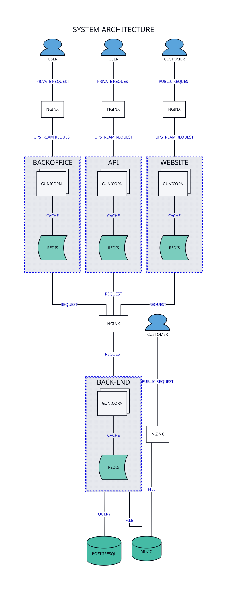
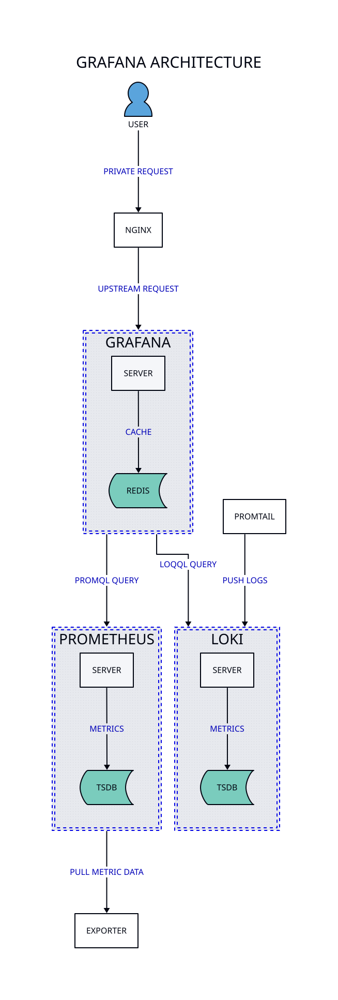

You can monitor the hosts and guests of your [Proxmox](https://proxmox.com/) cluster using the tools provided by [Grafana Labs](https://grafana.com/). Prometheus and Loki will be used to store metric data and logs, respectively, and Grafana will be used to visualise them. A number of Prometheus exporters and the Promtail agent will be installed on nodes, containers and virtual machines to retrieve and send the data.

## How does it work?

In short, exporters retrieve data from the guest or host and the Prometheus server pulls metrics from those exporters, or directly from applications that publish them, and saves that data in its time series database. Loki acts the same way via its Promtail agent that pushes the content of log files to the Loki server. Then Grafana queries the Prometheus and Loki servers and displays the data. Finally, [Prometheus AlertManager](https://prometheus.io/docs/alerting/latest/alertmanager/) and [Grafana Alerting](https://grafana.com/docs/grafana/latest/alerting/) send alerts when events are triggered.

We will install Prometheus, Loki and Grafana in separate containers in our cluster.

Prometheus fetches metrics using a pull mechanism, so the Prometheus server must be able to establish TCP connections to the monitored clients. Guests must have corresponding ports open and be reachable over the network.

Loki uses a push mechanism, so the Promtail agent in the guests and nodes need to be able to reach the Loki server.

## Example application

The above-mentioned tools can be used to monitor a myriad of applications and system parametres. In order not to lose sight of the essential, we will use a case scenario with a number of containers running the following services:

* Gunicorn servers running Django applications.
* MinIO server holding static and media files.
* NGINX servers acting as reverse proxies.
* PostgreSQL database servers.
* Redis servers to be used as cache.

As a reference, the following diagram partially illustrates the example scenario we want to monitor:

The solution displayed in this diagram neither intends to be complete nor optimal, but rather illustrate a simple-enough case scenario for this article. As you may have figured out already, there are no work queues, background processes, external APIs being consumed, high availability of data storages, etcetera.

## Logs and metrics being generated

The nodes, guests and services mentioned above are generating a number of logs and metrics (the application itself or via exporters). In this article, we will focus on the following metrics and logs:

| Service/entity    | Logfile | Metrics | Exporter             |
|-------------------|:-------:|:-------:|----------------------|
| Gunicorn          | x       | x       | `statsd_exporter`    |
| MinIO             |         | x       | `application`        |
| NGINX             | x       | x       | `nginx_exporter`     |
| PostgreSQL        |         | x       | `postgres_exporter`  |
| PowerDNS          |         | x       | `application`        |
| Redis             |         | x       | `redis_exporter`     |
| Syslog / journald | x       |         |                      |
| Tinyproxy         |         | x       | `tinyproxy_exporter` |

This is not an exhaustive list, but rather a set of logs and metrics that are of our interest for this article. In addition to the list displayed in the table, we will also be monitoring machines stats of both guests and hosts. We will use the Promtail agent to ship all logs.

## Proxmox

[Proxmox Virtual Environment](https://www.proxmox.com/en/products/proxmox-virtual-environment/overview) is an open-source virtualisation platform that integrates [*](KVM) for full virtualisation and [*](LXC) for lightweight, container-based virtualization. It provides web-based and command-line interfaces and a fully-featured API for managing storage, networking, virtual machines, containers, high-availability, and all aspects of the virtualisation stack. Proxmox VE is based on Debian Linux and includes a modified Linux kernel optimized for virtualization workloads.

Key features of Proxmox VE include support for clustering multiple nodes, live migration of [*](VM) between hosts, built-in backup and restore functionality, and integration with various storage backends such as [*](ZFS), Ceph, and [*](iSCSI). It also includes a role-based permission system and integrates with [*](LDAP) and Active Directory for authentication. The combination of [*](KVM) and [*](LXC) allows users to optimize resources by running both virtual machines and containers on the same infrastructure.

## Prometheus

[Prometheus](https://prometheus.io/) is an open-source monitoring tool that is used to collect and store real-time metrics, pulled via [*](HTTP), in a time-series database. Prometheus metrics are time series data, or timestamped values belonging to the same group or dimension. A metric is uniquely identified by its name and set of labels (key-value pairs).

| Metric name                      | Labels                                         | Timestamp   | Value       |
|----------------------------------|------------------------------------------------|-------------|-------------|
| `node_filesystem_avail_bytes`    | `{mountpoint="/", group="postgresql"}`         | @1725305992 | 12753068032 |
| `node_cpu_seconds_total`         | `{cpu="0", group="postgresql", mode="iowait"}` | @1725305992 | 141845.45   |

Each application or system being monitored must expose metrics in the format above, either through code instrumentation or Prometheus exporters.

We can leverage queries to create temporary times series from the source. These series are defined by metric names and labels. Queries are written in PromQL, whcih allows users to choose and aggregate time-series data in real time and can also help establish alert conditions, resulting in notifications to external systems.

Moreover, Prometheus can display collected data in tabular or graph form, shown in its web-based user interface, or you can also use APIs to integrate with third-party visualization solutions like Grafana.

## Prometheus exporters

Exporters are agents that help with exporting metrics from systems or services as Prometheus metrics. They are useful whenever it is not feasible to instrument a given application or system with Prometheus metrics directly. Multiple exporters can run on a monitored host to export local metrics.

The Prometheus community provides a [list of exporters](https://prometheus.io/docs/instrumenting/exporters/), a few of which are official whereas the vast majority are community contributions.

## Loki

[Loki](https://grafana.com/oss/loki/) is a log aggregation system, inspired by Prometheus, that stores and queries log files of all sorts available across our applications and infrastructure. It does not index the contents of the log files, but rather a set of labels for each log stream (i.e., it only indexes metadata).

| Timestamp                      | Labels                   | Content      |
|--------------------------------|--------------------------|--------------|
| 2024-09-24T10:01:02.123456789Z | `{service_name="nginx"}` | `GET /about` |

By indexing the metadata (the first two columns) instead of the whole set of logs, Loki requires less storage. The third column (the original log message) remains unindexed.

Loki stands out for splitting queries into small parts and executing them in parallel to speed up the search in large volumes of data. Unlike other systems that require large full-text indexes, Loki's index is significantly smaller than the volume of logs ingested. 

Loki assumes you have a well instrumented application. The idea is that you almost never need to look at logs because most of your questions can be answered by metrics instead. Compute time is moved from ingest time to query time. Metrics identify the general area, which reduces the search space for logs by a huge amount, leading to less use of logs (to the point where a "fancy grep" is all you need).

## Promtail

[Promtail](https://grafana.com/docs/loki/latest/send-data/promtail/) is the agent responsible for gathering logs and sending them to Loki. It is designed to discover targets, attach labels to log streams based on configurable rules, and push them to the Loki instance for storage and querying through Grafana's interface. Essentially, Promtail acts as the collector in the Loki logging stack.

Similar to how Prometheus uses exporters to collect metrics, Promtail serves as Loki's equivalent for log collection. It runs on each node in our infrastructure, tailing log files, processing their contents through a pipeline of stages, and shipping the processed logs to Loki for storage and querying through Grafana's interface. The labeling system Promtail uses is particularly powerful as it enables the same kind of dimensional data model that makes Prometheus metrics so flexible for querying.

## Grafana

[Grafana](https://grafana.com/grafana/) is an open-source tool for interactive data visualization and analysis. It is used to create dashboards with panels representing specific metrics over a set period of time. It integrates seamlessly with Loki and Prometheus to provide a user-friendly interface for log exploration and visualisation. Its dashboards allow insightful visualisations and alerts based on log and metric data, making it a powerful solution for monitoring, troubleshooting and gaining actionable insights.

As a reference, the following diagram partially illustrates the Grafana ecosystem:

## Grafana Alerting

[Grafana Alerting](https://grafana.com/docs/grafana/latest/alerting/) is an integrated alert management system embedded directly within the Grafana visualization platform. Tightly coupled with Grafana's dashboarding capabilities, this alerting system allows creating alert rules based on the same metrics they already monitor and visualize. The system evaluates these rules continuously against incoming data, transitioning alerts through defined states as conditions evolve, with all alert management occurring within the same familiar interface used for data exploration.

The architecture of Grafana Alerting unifies alerting across multiple data sources, allowing teams to create consistent alert definitions regardless of whether the underlying metrics come from Prometheus, InfluxDB, or other supported backends. This unified approach simplifies multi-source monitoring environments by providing a single pane of glass for alert definition, evaluation, and notification. Each alert can trigger customizable notifications through various channels, with rich context including relevant graphs and annotations to speed troubleshooting.

## NGINX

NGINX is an open-source web server software that is widely used for serving static content, handling reverse proxying, load balancing, and caching. NGINX is known for its high performance, stability, and low resource consumption, making it a popular choice.

One of the key features of NGINX is its ability to act as a reverse proxy server. In this role, NGINX sits between client devices and backend servers, forwarding client requests to the appropriate server and returning the server's response to the client. This setup can significantly enhance the performance, security, and reliability of web applications.

When used with monitoring and logging tools like Prometheus, Loki, and Grafana, NGINX can distribute incoming traffic and add an extra layer of security, facilitating the efficient and secure operation of complex applications.
