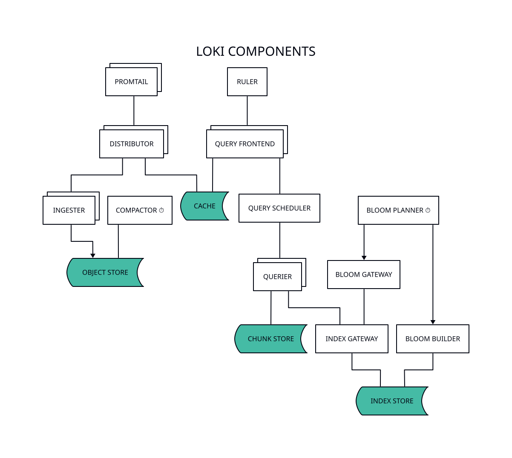
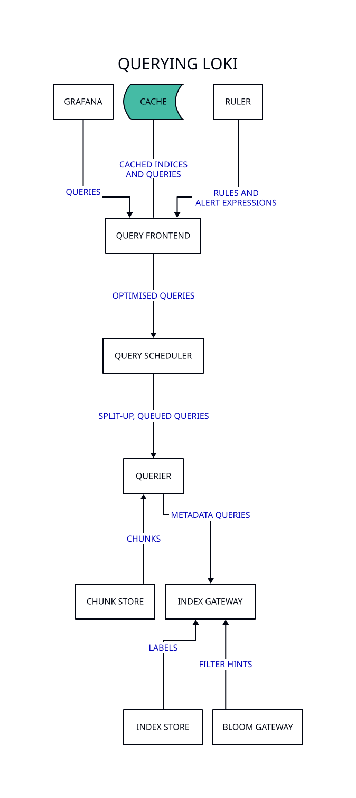
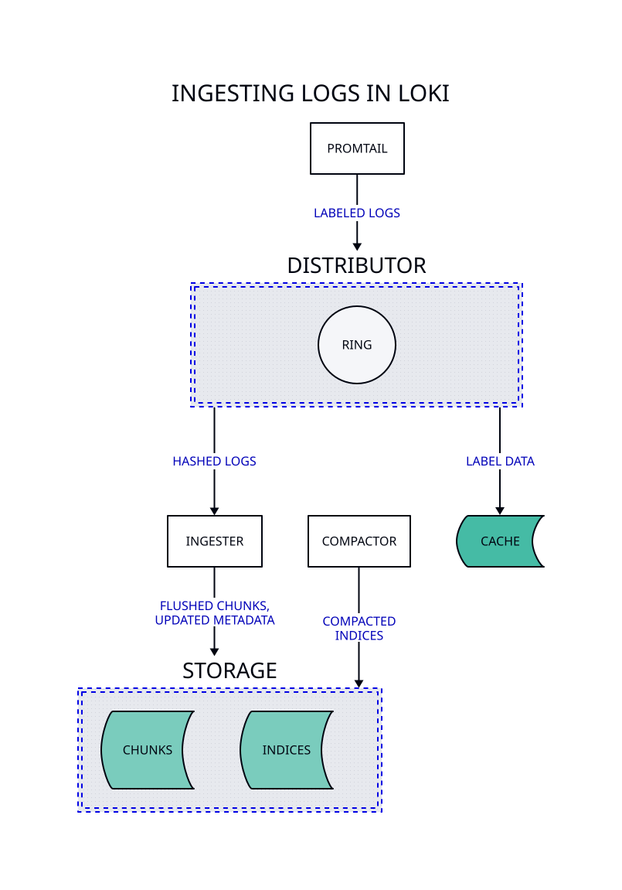

This article will make use of two [*](LXC) running [Debian GNU/Linux](https://www.debian.org/) on a Proxmox cluster to get the Loki server installed and set up to recieve and store log data.

1. `loki1.localdomain.com` will run the Loki server on port 8080.
2. `nginx1.localdomain.com` will run NGINX as a reverse proxy on port 443 at the public address `loki.publicdomain.com`.

This series assumes that an internal DNS server is installed and correctly configured. `localdomain.com` is the internal DNS zone used across the cluster, whereas `publicdomain.com` is a public DNS zone used to access services from the Internet.

The Loki server will be collecting log data sent by Promtail agents, which are running inside the host or guest you want to collect log data from. Therefore, Promtail is configured separately.

Promtail agents will connect to that address and port as they gather new entries in the log files they are monitoring, then Loki will store that data in its local, on-disk time-series database located at `/var/lib/loki/`.

## How does it work

Loki ingests logs from various sources (Promtail in our case), attaches metadata in the form of labels, and stores them in a time-series database (TSDB). Logs are queried from Loki using [*](LogQL), a query language similar to [*](PromQL), used by Prometheus. Loki is optimized for high write throughput and efficient storage.

When a query is made:

1. Loki identifies relevant log streams using the metadata labels.
2. It retrieves and filters log lines matching the query.
3. The results are presented in Grafana or other supported interfaces.

## What can it be used for

Loki can be used for:

* **Centralised log management**. Collect logs from multiple systems into a unified view.
* **Cost-effective logging**. Collect logs from multiple systems into a unified storage and prevent those systems from having to deal with resource-intensive tasks.
* **Observability**. Investigate application issues by correlating logs with metrics and traces, i.e., debugging and monitoring.
* **Historical analysis**. Retain logs over time for compliance, auditing, or performance analysis.

## Main components

Loki is a modular system that contains [many components](https://grafana.com/docs/loki/latest/get-started/components/). These components can either be run together (single-binary mode that runs all targets), in logical groups (simple, scalable deployment mode, each running `read`, `write` or `backend` targets), or individually (in microservice mode). This, in turn, is what allows it to scale.

| Component       | `all` | `read` | `write` | `backend` | Description                                                      |
|-----------------|:-----:|:------:|:-------:|:---------:|------------------------------------------------------------------|
| Distributor     | x     |        | x       |           | Handles push requests from clients                               |
| Ingester        | x     |        | x       |           | Persists data and ships it to long-term storage                  |
| Query front-end | x     | x      |         |           | Queues and optimises requests for the query scheduler            |
| Query scheduler | x     |        |         | x         | Used by the frontend to queue split-up queries for the querier   |
| Querier         | x     | x      |         |           | Executes [*](LogQL) queries                                      |
| Index gateway   | x     |        |         | x         | Handles and serves metadata queries                              |
| Compactor       | x     |        |         | x         | Compacts index files produced by ingesters                       |
| Ruler           | x     |        |         | x         | Manages and evaluates rule and alert expressions                 |
| Bloom planner   | x     |        |         | x         | Periodically plans the tasks for blooms creation                 |
| Bloom builder   | x     |        |         | x         | Processes tasks created by the planner to build data structures  |
| Bloom gateway   | x     |        |         | x         | Handles and serves chunks filtering requests using bloom filters |



## Installation

First of all, install some prerequisites:

```bash
apt-get install curl gnupg2 ca-certificates lsb-release debian-archive-keyring
```

Now import the [official Grafana signing key](https://apt.grafana.com/) so APT can verify the packages we will be intalling later on:

```bash
curl --silent https://apt.grafana.com/gpg.key | 
  gpg --dearmor --yes --output /etc/apt/keyrings/grafana.gpg
```

Set up the APT repository for the stable Grafana packages:

```bash
cat << EOF > /etc/apt/sources.list.d/apt-grafana.sources
X-Repolib-Name: APT Grafana
Types: deb
URIs: https://apt.grafana.com
Suites: stable
Components: main
Architectures: amd64
Signed-By: /etc/apt/keyrings/grafana.gpg
Enabled: yes
EOF
```

Set up repository pinning to prefer the packages from `apt.grafana.com` over the default ones:

```bash
echo -e "Package: *\nPin: origin apt.grafana.com\nPin: release o=stable\nPin-Priority: 900\n" \
  | tee /etc/apt/preferences.d/99loki
```

Now update the packages index and install Loki and Redis:

```bash
export LOKI_VERSION="3.5.1"
apt-get update
apt-get install loki=${LOKI_VERSION} redis
```

## Redis configuration

Loki uses [Redis](https://redis.io/) for caching. Redis requires minimum configuration, which is done by editing the following options in the `/etc/redis/redis.conf` file:

```conf
requirepass <password>
maxmemory 100mb
maxmemory-policy allkeys-lru
```

The password can be generated with the following command:

```bash
openssl rand -base64 25 | tr --delete /=+ | cut --characters -32
```

And restart Redis:

```bash
systemctl restart redis
```

## Loki configuration

The Loki server uses a single configuration file `/etc/loki/config.yml` in [*](YAML) format, which contains information on the Loki server and its individual components. This file is passed by the [systemd](https://systemd.io/) service file[^1] to the executable as an argument. It is a very large file, so let's start by introducing the main sections available:

[^1]: `Located at `/etc/systemd/system/loki.service`

| Key                     | Description                                                            |
|-------------------------|------------------------------------------------------------------------|
| `target`                | A list of components to run                                            |
| `auth_enabled`          | Enables authentication and authorization                               |
| `ballast_bytes`         | Helps optimize garbage collection                                      |
| `server`                | Configures the main HTTP and gRPC server settings                      |
| `common`                | Shared configuration settings across components                        |
| `distributor`           | Controls how log entries are distributed to ingesters                  |
| `querier`               | Configures query execution and result handling                         |
| `query_scheduler`       | Manages the scheduling of queries across multiple queriers             |
| `frontend`              | Configures the query frontend for handling and caching queries         |
| `query_range`           | Controls range query splitting, caching, and parallelization           |
| `ruler`                 | Manages alerting and recording rules                                   |
| `ruler_storage`         | Manages connections to the Thanos Object Storage[^2] client            |
| `ingester_client`       | Configures how the distributor communicates with ingesters             |
| `ingester`              | Sets up the ingester component, which writes logs to storage           |
| `block_builder`         | Defines how log data is constructe and compressed into chunks          |
| `block_scheduler`       | Manages the scheduling of block-building jobs                          |
| `pattern_ingester`      | Configures pattern-based log ingestion                                 |
| `index_gateway`         | Manages index queries without constant interaction with object storage |
| `bloom_build`           | Builds bloom filters[^3] for efficient querying                        |
| `bloom_gateway`         | Serves queries using bloom filters                                     |
| `storage_config`        | Defines storage backends for chunks and indexes                        |
| `chunk_store_config`    | Configures caching and flushing behavior for chunks                    |
| `schema_config`         | Sets up the schema for indexing and storing logs                       |
| `compactor`             | Configures index compaction for performance and cost optimization      |
| `compactor_grpc_client` | Configures gRPC client settings for the compactor                      |
| `limits_config`         | Sets global and per-tenant limits for ingestion and querying           |
| `frontend_worker`       | Configures workers that process queries from the frontend              |
| `table_manager`         | Manages the lifecycle of index tables                                  |
| `memberlist`            | Configures memberlist-based KV store for cluster coordination          |
| `dataobj_explorer`      | Allow to interactively inspect the contents of the object storage      |
| `runtime_config`        | Allows dynamic configuration changes at runtime                        |
| `operational_config`    | Sets operational parameters for the Loki instance                      |
| `tracing`               | Configures distributed tracing settings                                |
| `analytics`             | Enables analytics collection for usage insights.                       |
| `profiling`             | Sets up profiling to analyze performance.                              |
| `shutdown_delay`        | Delays shutdown to allow in-flight requests to complete.               |
| `metrics_namespace`     | Sets a prefix for all emitted metrics.                                 |

[^2]: The [Thanos Object Storage Client](https://grafana.com/docs/loki/latest/setup/migrate/migrate-storage-clients/) provides a unified interface to work with various object storage providers.
[^3]: Bloom filters are space-efficient, probabilistic data structures used to test whether an element is a member of a set.

We will be using most of these sections, but not all.

## Configuring Loki

We will be using the configuration keys listed above to configure our Loki server in a single instance, named `loki1.localdomain.com`, somewhat following the order determined by the default `/etc/loki/config.yml` file shipped by Grafana Labs with the `loki` package and the order presented in the [Grafana Loki configuration parameters documentation](https://grafana.com/docs/loki/latest/configure/).

We will be making explicit some default configuration values to make them easier to find and adjust as we progress through the series and feed more and more logs to Loki.

At the moment, Loki requires a restart when its configuration changes. So, when you have gone through all the configuration options and your `/etc/loki/config.yml` file is ready, issue the following command:

```bash
systemctl restart loki
```

### Basic options

We will be running all components in a single instance. Moreover, we will be delegating authentication onto the NGINX reverse proxy and using the firewall to restrict access to the server.

```yaml
# Run all components in single binary mode
target: all

# Disable authentication
auth_enabled: false

# Optionally, disable reporting statistics to stats.grafana.org
analytics:
  reporting_enabled: false
```

### Server options

Both Grafana and our Promtail agents will be using HTTP to communicate with Loki. However, Loki components communicate among themselves using gRPC.

```yaml
# Configuration options of the Loki server.
# See: https://grafana.com/docs/loki/latest/configure/#server
# Log level is set to `info` by default.
server:

  # Optionally, change the default ports
  http_listen_port: 8080
  grpc_listen_port: 8081

  # Default listen addresses
  http_listen_address: "0.0.0.0"
  grpc_listen_address: "0.0.0.0"

  # TLS configuration over HTTP
  # All gRPC connections will use the localhost, so no TLS needed
  tls_min_version: VersionTLS12
  http_tls_config:
    cert_file: "/etc/ssl/certs/localdomain.com.crt"
    key_file: "/etc/ssl/private/localdomain.com.key"

  # Log level
  log_level: info

  # Default size limit of gRPC messages this server can receive and send (4 MB)
  grpc_server_max_recv_msg_size: 4194304
  grpc_server_max_send_msg_size: 4194304

  # Increase the limit on the number of concurrent streams for gRPC
  # calls per client connection from 100 to 1K
  grpc_server_max_concurrent_streams: 1000
```

### Common options

These are base configuration options that will be inherited by multiple modules, and which can be overriden in each module-specific configuration section.

We will be using the filesystem as storage, which is the default option. The package uses the subdirectory `/tmp/loki` by default, but we will be adapting that to Debian standards.

```yaml
# Common configuration to be shared between multiple modules
# See: https://grafana.com/docs/loki/latest/configure/#common
common:
  path_prefix: /var/lib/loki
  storage:
    # Use the local filesystem as storage
    filesystem:
      # Directory to store chunks in
      chunks_directory: /var/lib/loki/chunks
      # Directory to store rules in
      rules_directory: /var/lib/loki/rules
  
  # Instruct components to use the localhost to communicate among themselves
  instance_addr: 127.0.0.1

  # Adapt the default replication factor to a single-instance deploy
  replication_factor: 1

  # Use the in-memory key/value store
  ring:
    kvstore:
      store: inmemory
```

The `instance_addr` is the IP address components will use to advertise themselves to the cluster. It affects all inter-component communication (ring, gRPC, health checks, etc).

The `replication_factor` determines how many copies of log streams are stored across ingesters. In a single-instance deployment we must set this to 1, as the default value of 3 would cause Loki to attempt replication to non-existent instances.

The `ring` in Loki is a coordination mechanism used by components to track their ownership of data shards. It uses a hash ring to ensure log streams are consistently mapped to specific ingesters, which is key for maintaining data consistency and replication in multi-instance deployments.

In our single-instance setup, the ring's main purpose is to satisfy Loki's internal architecture requirements, so there is no need for distributed key-value stores like [etcd](https://etcd.io/).

### Query frontend

This section configures how the query frontend component will behave in regards to query splitting and caching. We will be using Redis instead of the default embedded cache, and using compression and caching as much as possible.

```yaml
# Configuration options for query splitting and caching in the query-frontend
query_range:
  
  # Cache backend for the query frontend component
  results_cache:
  
    # Configures the cache backend for a specific component.
    # See: https://grafana.com/docs/loki/latest/configure/#cache_config
    cache:
  
      # Default validity of entries (unless overridden)
      default_validity: 1h

      # Redis server configuration
      redis:
        # Redis endpoint
        endpoint: 127.0.0.1:6379
        # Let Loki manage TTL via default validity
        expiration: 0s
        # Let Loki auto-scale (10 per CPU core)
        pool_size: 0
        # Password to use when connecting to Redis
        password: <password>
        # Keep idle connections open indefinitely
        idle_timeout: 0s
        # Keep connections alive forever
        max_connection_age: 0s

    # Use compression in cache
    compression: snappy

  # Cache query results (default is false)
  cache_results: true

  # Default behaviour to cache index stats, volume, series and label  query results
  cache_index_stats_results: true
  cache_volume_results: true
  cache_series_results: true
  cache_label_results: true
```

### Global limits

The `limits_config` block configures global and per-tenant limits in Loki. It supports a large array of options so, to make it easier to understand and maintain, it is presented split into categories. Moreover, we will be using Loki to meet long-term storage legal requirements.

> Sample size includes the size of the logs line and the size of structured metadata labels

```yaml
# Configure global limits
# See: https://grafana.com/docs/loki/latest/configure/#limits_config
limits_config:

  # A. Ingestion and rate limit

  # Enforce limits globally
  ingestion_rate_strategy: "global"

  # Default per-user ingestion rate limit in sample size per second (4MB)
  ingestion_rate_mb: 4

  # Default per-user allowed ingestion burst size (6MB). Burst size is the per-distributor
  # local rate limiter. Should be aligned with the expected max payload size per push request.
  ingestion_burst_size_mb: 6

  # Default maximum byte rate per second per stream (3MB)
  per_stream_rate_limit: "3MB"

  # Default maximum burst bytes per stream (15MB)
  per_stream_rate_limit_burst: "15MB"

  # B. Retention and aging

  # Default behaviour to reject samples meeting the criteria below
  reject_old_samples: true

  # Default maximum accepted sample age
  reject_old_samples_max_age: "1w"
  
  # Duration which table will be created/deleted before/after it is needed.
  # Samples from before this time will not be accepted.
  creation_grace_period: "10m"

  # Retention period to apply to stored data. Must be either 0 (disabled) or a multiple of 24h.
  # Requires `compactor.retention_enabled = true`. 43800 hours equals 5 years.
  retention_period: "43800h"

  # Default deletion mode
  deletion_mode: "filter-and-delete"

  # C. Query and performance

  # Enable metric aggregation to speed up histogram queries
  metric_aggregation_enabled: true

  # Default maximum number of unique series that is returned by a metric query
  max_query_series: 500

  # Default maximum number of queries that will be scheduled in parallel by the frontend
  max_query_parallelism: 32

  # Default limit to length of chunk store queries
  max_query_length: 30d1h

  # Default (lack of) limit to the length of the [range] inside a range query
  max_query_range: 0s

  # D. Metadata and features

  # Do not attempt auto-discovery of log levels during ingestion.
  # We will do this manually, via regex within Promtail.
  discover_log_levels: false

  # Default maximum number of active streams per user, across the cluster
  max_global_streams_per_user: 5000

  # Default behaviour to allow user to send structured metadata in push payload
  allow_structured_metadata: true

  # Default behaviour to enable log-volume endpoints for log volume dashboards.
  # Allows aggregating log counts (or sizes) over specified time ranges, grouped by labels,
  # e.g., "logs per minute" trend.
  volume_enabled: true
```

### Compactor

The compactor component compacts index shards for performance and also takes care of retention, that is, deleting logs that are considered too old. The default behaviour of Loki is to keep logs forever, which we want to change to meet our needs.

```yaml
# Configuration options of the compactor.
# See: https://grafana.com/docs/loki/latest/configure/#compactor
compactor:
  # Activate custom (per-stream, per-tenant) retention
  retention_enabled: true

  # Default aximum number of tables to compact in parallel
  max_compaction_parallelism: 1

  # Default number of upload/remove operations to execute in parallel when finalizing
  # a compaction, per compact operation, which can be executed in parallel
  upload_parallelism: 10

  # Define a store to be used for managing delete requests (default is none, which is invalid)
  # Requires setting `storage_config.filesystem.directory`.
  delete_request_store: filesystem

  # Default max number of delete requests to run per compaction cycle
  delete_batch_size: 70

  # Default interval at which compaction operations are run (how often)
  compaction_interval: 10m

  # Default delay after which chunks will be fully deleted during retention
  retention_delete_delay: 2h

  # Default working directory to store downloaded bloom blocks
  working_directory: "/var/lib/loki/compactor"
```

### Ingester

We will attempt an optimised `ingester` configuration to balance chunk file count, memory usage and reliability in our single-instance Loki using filesystem storage on ZFS with compression enabled. Flushing of received log streams from memory to disk will happen both based on time and size.

```yaml
# Configuration options of the ingester.
# See: https://grafana.com/docs/loki/latest/configure/#ingester
ingester:

  # Flush chunks after 24h to prevent too many small files
  max_chunk_age: 24h

  # Align with `max_chunk_age` to flush inactive streams
  chunk_idle_period: 24h

  # Increase target compressed size (2MB) for chunks to balance file count and query performance.
  chunk_target_size: 2097152

  # Default target uncompressed size (256KB) of a chunk block lets ZFS compression handle this
  # effficiently. When this threshold is exceeded, the head block will be cut and compressed
  # inside the chunk.
  chunk_block_size: 262144

  # Retain chunks in memory after they have been flushed for late-arriving logs
  chunk_retain_period: 15m

  # Default maximum retries for failed flushes, critical for filesystem reliability
  max_retries: 10

  # How the lifecycle of the ingester will operate
  lifecycler:
    ring:

      # Default period at which to heartbeat to the ring
      heartbeat_period: 15s

      # Default heartbeat timeout after which compactors are considered unhealthy within the ring
      heartbeat_timeout: 1m

    # Default duration to sleep before exiting on shutdown (no data loss with WAL)
    final_sleep: 0s
```

### Schema

This section configures the chunk index schema and where it is stored. We will be maintaining daily index and chunk tables and we will be splitting indices and chunks into subdirectories to prevent large amounts of files populating a single directory on our local, on-disk time series database.

```yaml
# Configuration options of the schema.
# See: https://grafana.com/docs/loki/latest/configure/#schema_config
# See: https://grafana.com/docs/loki/latest/configure/#period_config
schema_config:
  
  # Configures the chunk index schema and where it is stored.
  configs:
 
    # Configure what index schemas should be used for from specific time periods
    # The date of the first day that index buckets should be created
    - from: "2024-01-01"
 
      # Which index to use. Either 'tsdb' or 'boltdb-shipper'.  <store>
      # and <object_store> below affect which <storage_config> key is used.
      store: tsdb
      # Which store to use for the chunks
      object_store: filesystem
      # The schema version to use (current recommended schema is v13).
      schema: v13
  
      # Configures how the index is updated and stored
      index:
        # Path prefix for index tables. Prefix always needs to end with a path
        # delimiter '/', except when the prefix is empty (default is "index/").
        path_prefix: "index/"
        # Table prefix for all period tables (default is "")
        prefix: "index_"
        # Table period. Retention is only available if the index period is 24h.
        # Single store TSDB and single store BoltDB require 24h index period.
        period: "24h"

      # Configure how the chunks are updated and stored
      chunks:
        # Table prefix for all period tables
        prefix: "chunks_"
        # Table period
        period: "24h"

      # Default number of shards that will be created is fine unless high cardinality is
      # encountered (many unique label combinations).
      row_shards: 16
```

### Pattern ingester

The pattern ingester allows the logs to be analyzed for patterns and also enables the creation of [Bloom filters](https://en.wikipedia.org/wiki/Bloom_filter). A bloom filter is a space-efficient probabilistic data structure that is used to determine whether a set of data belongs to a subset.

The configuration of the bloom servers, responsible for building bloom filters, is done in the `bloom_build` section. Similarly, the configuration of the bloom gateway server, responsible for serving queries for filtering chunks based on filter expressions, is done in the `bloom_gateway` section. Both these servers are experimental as of the current version of Loki.

```yaml
# Configuration options of the pattern ingester.
# See: https://grafana.com/docs/loki/latest/configure/#pattern-ingester
pattern_ingester:

  # Enable the pattern ingester
  enabled: true

  # Metric aggregation settings
  metric_aggregation:

    # Address of the Loki instance to push aggregated metrics to,
    # matching `server.http_listen_address` and `server.http_listen_port`
    loki_address: 127.0.0.1:8080

    # HTTP client tuning
    http_client_config:
      enable_http2: true
      proxy_from_environment: false
      # Fail fast on slow pushes
      timeout: 10s
      # Disabled for security
      follow_redirects: false

    # Reduce load by incresing the default value (30s) of the interval between operations
    pull_push_interval: 2m

  # Configures how the lifecycle of the pattern ingester will operate and where
  # it will register for discovery.
  lifecycler:
    # `ring` inherits from `common.ring` (in-memory)
    # Default period at which to heartbeat
    heartbeat_period: 5s
    # Default heartbeat timeout after which instance is assumed to be unhealthy
    heartbeat_timeout: 1m    

# Configuration options for the bloom planner and builder servers
bloom_build:

  # Enable the experimental feature
  enabled: true

  # Limit concurrency so two bloom‑build tasks run at once
  max_builders: 2
  # Retry each individual bloom‑build task twice on failure before marking it as failed
  task_max_retries: 2
  # How long the planner will wait for a builder to acknowledge or complete a task before requeuing
  builder_response_timeout: 30s
  # ZFS already compresses disk storage, but this helps in-memory transfer efficiency and page size
  bloom_block_encoding: "zstd"
  # Once a new bloom block is built, fetch it into the gateway's cache so queries can use it without extra latency
  prefetch_blocks: true

  # Decrease the default to 150MB to keep down the heap footprint of each builder task.
  # Smaller blocks give the builder more, finer‑grained units of work.
  # In a single‑instance environment, this helps distribute CPU and I/O more evenly across cores.
  max_block_size: 150MiB
  # Maximum size of the raw bloom filter per individual time series. Filters larger than this are dropped.
  max_bloom_size: 64MiB
  # Instruct the planner to break the series key‑space into 128 slices so builds can run in parallel,
  # smaller units, aiming for roughly 8 GB of series data per bloom‑build task.
  planning_strategy: "split_keyspace_by_factor"
  split_keyspace_by: 128
  split_target_series_chunk_size: 8GB

  # Configuration options for the bloom planner server
  planner:

    # Running the bloom creation planning twice a day is enough
    planning_interval: 12h

    # Cover recent activity and include recent historical context.
    # Setting `min_table_offset`to 0 ensures that the current active index table (where most
    # writes happen) is included, which enables faster recent queries.
    # Setting `max_table_offset` to 2 means the planner includes the last two inactive tables
    # as well, which helps with queries that span recent time windows (e.g., last 24–48h).
    # Because older tables rarely change, there is little benefit in trying to replan them
    # every time unless retention requirements change.
    min_table_offset: 0
    max_table_offset: 2

    retention:
      # Enable bloom retention
      enabled: true
    queue:
      # Reduce the default maximum number of tasks to queue per tenant to keep the queue size
      # modest, reducing the change of OOM and GC pressure in our single instance. Even under
      # heavy indexing, 1000 pending bloom‑build tasks provides ample headroom.
      max_queued_tasks_per_tenant: 1000
      # Move queued tasks off the heap and onto the ZFS filesystem to avoi bloating memory.
      # ZFS has built-in compression, which makes on-disk queues very space-efficient.
      store_tasks_on_disk: true
      # Directory to store tasks on disk.
      tasks_disk_directory: /var/lib/loki/bloom-planner-queue
      # Default setting not to clean the tasks directory upon startup.
      clean_tasks_directory: false

  # Configuration options for the bloom builder server
  builder:
    # Address and port of the bloom planner,
    # matching `server.grpc_listen_address` and `server.grpc_listen_port`.
    planner_address: 127.0.0.1:8081

    # See: https://grafana.com/docs/loki/latest/configure/#grpc_client
    grpc_config:
      # Decrease the maximum size of messages from 100MB to 10MB to prevent a single huge
      # bloom‑filter transfer from triggering a GC stall or OOM in our single-instance deploy
      # and to align with expected bloom-block sizes
      max_send_msg_size: 10485760
      max_recv_msg_size: 10485760

    # Controls how the builder retries when an individual bloom‑build task (its gRPC call to 
    # the planner) fails temporarily, e.g., due to CPU contention, or I/O stall).
    # It implements an exponential‑style retry delay so that the system:
    # 1. Doesn’t hammer the planner continuously on every failure
    # 2. Gives transient issues time to clear before trying again.
    # 3. Eventually gives up (after `max_retries`) 
    backoff_config:
      # These backoff settings keep bloom‑build tasks responsive to transient hiccups while 
      # ensuring fail‑fast behavior for persistent problems—ideal for a single‑instance

      # Prevents hot‑looping on very rapid retries (100 ms can be too tight under load).
      # A slightly longer base delay gives transient pressure (e.g. brief CPU spikes or 
      # filesystem contention) time to settle.
      min_period: 250ms
      # Caps backoff so that, in persistent error scenarios, we don’t end up waiting a 
      # full 10 s before retrying. A 5 s ceiling balances giving the system breathing 
      # space versus surfacing issues faster.
      max_period: 5s
      # Halves the default retry count so that truly failing tasks will give up sooner,
      # free up queue slots, and let you detect and investigate root causes, rather than 
      # thrashing on repeated futile retries.
      max_retries: 5

bloom_gateway:

  # Turn the gateway on so queries can use Bloom filters to skip irrelevant chunks
  # and actually apply the bloom‑based chunk filtering in the read path
  enabled: true
  enable_filtering: true

  # Number of parallel workers testing chunks against Bloom filters
  worker_concurrency: 2
  # Lower the number of blocks each worker can check at once to reduce peak memory and gRPC streams
  block_query_concurrency: 4
  # Reduce the size of the in-flight Bloom-filter checks per tenant queue to keep memory bounded
  # and back-presure predictable in our single-instance.
  max_outstanding_per_tenant: 256
  # Redice the chunk-filter tasks to batch together to reduce per-RPC payload size, easing gRPC
  # backpressure and GC presure.
  num_multiplex_tasks: 128

  client:
    # Point the gateway's gRPC client at the planner endpoint,
    # matching `server.grpc_listen_address` and `server.grpc_listen_port`.
    addresses: 127.0.0.1:8081
    pool_config:
      # Decreas how often the client refreshes its list of gateway backends, to reduce DNS or
      # service-discovery churn on a stable, single-node address list.
      check_interval: 30s
    grpc_client_config:
      # Cap gRPC message sizes to 10 MB to bound per-RPC memory (from 100 MB) to reduce chances of
      # triggering GC spikes if a single RPC returns many blocks.
      max_send_msg_size: 10MiB
      max_recv_msg_size: 10MiB
```

Together, these settings let our Loki instance actually use Bloom filters for faster queries, while keeping resource use bounded and predictable on a single‑node ZFS system.

* **Memory**: Lower concurrency, smaller batches and tighter limits on in‑flight tasks/RPC sizes prevent a single process from ballooning RAM usage.
* **CPU**: Fewer workers and block‑checks align with modest core counts (2–4 cores), avoiding excessive context‑switching.
* **Filesystem**: ZFS compression and caching handle on‑disk Bloom blocks; smaller in‑memory buffers play nicely with ARC without displacing hot data.

### Ruler

The Loki Ruler continuously evaluates Prometheus‑style recording and alerting rules against our log data. At this point, we will not be using any rules, neither recording nor alerting. We will configure and use Alertmanager later on in this series, in a separate article.

```yaml
# Top‑level storage config for the ruler (replaces deprecated `ruler.storage`)
ruler_storage:
  backend: filesystem
  local:
    # Where rule files in YAML format will be stored
    directory: /var/lib/loki/rules

ruler:
  # Do not expose the alert‑rule API until Alertmanager is in play
  enable_api: false
```

### Frontend

The frontend in Loki sits at the edge of the query path. It accepts incoming HTTP queries, handles request‑level concerns, such as timeouts, body‑size limits and logging, enforces per‑tenant concurrency controls, and then forwards work to the querier or scheduler. Tuning the frontend lets us balance throughput, latency, and resource use.

```yaml
frontend:

  # Log slow queries
  log_queries_longer_than: 500ms

  # Include these request headers in slow‑query logs
  log_query_request_headers: "User‑Agent,X‑Request‑ID"

  # Enable per‑query stats
  query_stats_enabled: true

  # Bump max body size of requests from 10 MB to 20 MB
  max_body_size: 20971520

  # Throttle concurrent outstanding queries per tenant to bound memory,
  # improving efficiency of ZFS ARC, if present
  max_outstanding_per_tenant: 512

  # Increase the time between DNS lookups of the scheduler
  scheduler_dns_lookup_period: 30s

  # Reduce the time to wait for in‑flight queries on shutdown
  graceful_shutdown_timeout: 2m
```

For reference, the default value of the `encoding` parametre, i.e., `json`, only affects how the frontend interprets the incoming query payloads over HTTP, not how it talks to queriers or schedulers. Those interactions use gRPC with protobuf, regardless of this setting. Moreover, HTTP responses are compressed by default.

In our single-instance Loki we will not be using sharding, therefore the default values of `frontend.enable_sharding: false` and `frontend.strategy: default` are adequate.

Slow‑query logging & stats will allow us to tune performance. They will be visible in the `journald` using a format similar to the following one:

```console
# journalctl --unit=loki --follow
level=info ts=2025-05-12T14:50:02.123Z caller=frontend.go:XXX msg="slow query detected" query_duration=611.342ms method=GET path=/loki/api/v1/query_range params="..." headers="User-Agent=Grafana/X.X"
```



### Querier

The querier is Loki's workhorse for executing log queries. It pulls data from both in-memory ingesters and long-term storage (chunks), merges and filters streams, applies query transformations (e.g., `|=` or `|~`), and returns the assembled result to the frontend or directly to the client.

```yaml
querier:
  # Adapt the number of concurrent queries for 2-4 CPU cores
  max_concurrent: 4

  # Decrease message size from 100 MiB to 10 MiB to bound memory per-RPC
  grpc_client_config:
    max_send_msg_size: 10485760
    max_recv_msg_size: 10485760
```

Most default values in this section are already aimed at a single-instance Loki installation, thus we just had to adjust the concurrency and the message size. Next you can find the list of directives with default values that you can add to your configuration file for reference, or skip them if you prefer to keep it shorter.

```yaml
  # Default values of the engine, for reference
  engine:
    # Cap how far an instant query looks back
    max_look_back_period: 30s
    # topk sketch size
    max_count_min_sketch_heap_size: 10000

  # Default values regarding multi-tenancy, for reference
  # Read both ingesters & store
  query_store_only: false
  # Skip store if object store is unavailable
  query_ingester_only: false
  # Single-tenant mode
  multi_tenant_queries_enabled: false
  # No header-based overrides
  per_request_limits_enabled: false
  # No partitioning of ingesters
  query_partition_ingesters: false

  # Default values of query size and volume limits, for reference
  # Prevent runaway chunk scans
  max_chunks_per_query: 2000000
  # Cap series returned
  max_query_series: 500
  # Allow going all the way back in time when querying data and metadata
  max_query_lookback: 0s
  # Maximum span of a single query
  max_query_length: 30d1h
  # Do not limit the length of the range in range queries
  max_query_range: 0s
  # Maximum number of queries that will be scheduled in parallel by the frontend
  max_query_parallelism: 32
  # Maximum number of queries will be scheduled in parallel by the frontend for TSDB schemas.
  tsdb_max_query_parallelism: 128
  # Target maximum number of bytes assigned to a single sharded query
  tsdb_max_bytes_per_shard: 600MB
  # Sharding strategy to use in query planning
  tsdb_sharding_strategy: "power_of_two"

  # Default values of frontend and scheduler integration, for reference. When neither
  # `frontend_address` nor `scheduler_address` are set, queries are only received via HTTP endpoint.
  frontend_address: ""
  scheduler_address: ""
```

### Query range

This block governs how range queries are split for parallelism and how their partial results are cached before assembly. Loki offers six separate results caches in the `query_range`/`querier` scope:

| Cache type         | What is cached                                                       |
|--------------------|----------------------------------------------------------------------|
| Time‐range results | Final merged time-series datapoints returned by a range query        |
| Index statistics   | Series counts and label-cardinality statistics used in dashboards    |
| Log‐volume metrics | Total count and size of log lines matching a query over a time range |
| Series lists       | Sets of series keys that match a given log selector                  |
| Label values       | All observed values for a particular label name and selector         |
| Instant metrics    | Single-point metric queries (e.g., error rates, gauges at `now`)     |

We will be configuring all of them to use Redis to benefit from persistence across restarts. Unfortunately, at the moment Loki does not offer a way to reduce the verbosity of such configuration.

The default values of all other directives suit our needs. We will be explicit about two of them, for reference.

```yaml
query_range:
  # Keep raw time bounds, i.e., do not mutate incoming queries to align their
  # start and end with their step (this is the default behaviour).
  align_queries_with_step: false
  # Do not attempt to parallelise query execution via a shared scheduler (default behaviour).
  parallelise_shardable_queries: false

  # Time-range results cache
  cache_results: true
  results_cache:
    cache:
      redis:
        endpoint: 127.0.0.1:6379
        password: <password>
        expiration: 1h
        pool_size: 10
        idle_timeout: 30s
        max_connection_age: 5m
    compression: snappy

  # Index‐stats cache
  cache_index_stats_results: true
  index_stats_results_cache:
    cache:
      redis:
        endpoint: 127.0.0.1:6379
        password: <password>
        # Fresher index counts
        expiration: 15m
        pool_size: 5
        idle_timeout: 30s
        max_connection_age: 5m
    compression: snappy

  # Volume‐results cache
  cache_volume_results: true
  volume_results_cache:
    cache:
      redis:
        endpoint: 127.0.0.1:6379
        password: <password>
        expiration: 1h
        pool_size: 5
        idle_timeout: 30s
        max_connection_age: 5m
    compression: snappy

  # Series‐results cache
  cache_series_results: true
  series_results_cache:
    cache:
      redis:
        endpoint: 127.0.0.1:6379
        password: <password>
        expiration: 1h
        pool_size: 5
        idle_timeout: 30s
        max_connection_age: 5m
    compression: snappy

  # Label‐values cache
  cache_label_results: true
  label_results_cache:
    cache:
      redis:
        endpoint: 127.0.0.1:6379
        password: <password>
        # Labels change less often
        expiration: 2h
        pool_size: 5
        idle_timeout: 30s
        max_connection_age: 5m
    compression: snappy

  # Instant‐metric cache
  cache_instant_metric_results: true
  instant_metric_results_cache:
    cache:
      redis:
        endpoint: 127.0.0.1:6379
        password: <password>
        expiration: 30m
        pool_size: 5
        idle_timeout: 30s
        max_connection_age: 5m
    compression: snappy
```

Some use cases can help understand what is stored in each cache. The LogQL expressions are not efficient, but they have intentionally been kept simple.

| Cache type         | LogQL expression                                | Use case                                                           |
|--------------------|-------------------------------------------------|--------------------------------------------------------------------|
| Time-range results | `count_over_time({job="nginx"} \|= "GET" [5m])` | Show the number of GET requests over time in a Grafana graph panel |
| Index statistics   | `count_over_time({job="nginx"} \|= "GET" [1h])` | Estimate the number of matching log series for tooltip or panels   |
| Log volume         | `count_over_time({job="nginx"} \|= "GET" [5m])` | Approximate how much log traffic occurred (by line count)          |
| Series list        | `count_over_time({job="nginx"} \|= "GET" [1h])` | Identify which label combinations exist for matching logs          |
| Label values       | `label_values({job="nginx"} \|= "GET", status)` | Used by Grafana to build dropdowns for status code filters         |
| Instant metrics    | `count_over_time({job="nginx"} \|= "GET" [1m])` | Return a single value to power a Grafana gauge or alert            |

Although some of the examples are repeated, each is cached and used differently under the hood. We are getting ahead of ourselves, but note that the same query (e.g., `count_over_time({job="nginx"} |= "GET" [1m])`) may use multiple caches, i.e., it is cached differently depending on how the query is run:

* If it is used in a Grafana graph panel (with a time range), it will be executed as a range query (via `/loki/api/v1/query_range`), and the result will be cached in the time-range results cache.
* If it is used in a gauge panel, an alert rule, or Grafana's "Instant" mode, it becomes an instant query (via `/loki/api/v1/query`), returning a single value, therefore this result will be cached in the instant metric cache.
* If Grafana needs to autocomplete label values for a filter (like `status`), it might run a query like `label_values(...)`, which is served by the label values cache.

So, even if two queries look the same in LogQL, Loki may cache and retrieve them differently depending on how and where they are executed.

## Ingesting logs

Loki ingests logs by flowing them through a set of components, each with a specific role in accepting, processing, storing, and indexing log data. While some components are optional or only used in larger deployments, understanding the overall ingestion path helps clarify how logs are labeled, routed, stored, and queried efficiently. Below is a high-level walkthrough of the ingestion pipeline:

1. **Distributor**. Accepts incoming log entries from clients (e.g., Promtail), validates them, splits them into streams based on labels, and assigns them to ingesters using consistent hashing. It ensures that logs with the same label set are routed to the same ingester.

2. **Ingester**. Receives logs from the distributor and temporarily buffers them in memory. It batches logs into compressed chunks, which are flushed to long-term storage when they reach a size, age, or idle threshold. Ingester also handles log replication and exposes recent logs for queries.

3. **Query frontend** *(optional)*. Sits between Grafana (or API clients) and the querier. It improves query responsiveness by splitting large queries into subqueries, caching results, and distributing load. Especially useful in high-volume or multi-tenant setups.

4. **Query scheduler** *(optional)*. Enhances scalability and fairness by decoupling query queueing from execution. It receives subqueries from the query frontend, enqueues them in per-tenant queues, and dispatches them to queriers for execution.

5. **Querier**. Executes user queries written in LogQL. It fetches recent logs from ingesters and historical chunks from storage, merges the results, filters them by labels and content, and returns them to the user.

6. **Index gateway**. Acts as an intermediate between queriers and the index store. It caches and serves index data (i.e., label → chunk mappings), reducing pressure on the index backend and improving query latency.

7. **Chunk store**. The long-term storage backend for compressed log chunks. This can be a local filesystem, object storage (e.g., S3, GCS), or another supported store. Chunks are stored in efficient compressed formats.

8. **Index store**. Stores metadata about where to find logs based on label matchers. This index maps stream labels to chunk references and is used to quickly find candidate chunks during query execution.

9. **Promtail**. A log shipper that reads logs from sources like files, `journald`, or syslog. It attaches labels (e.g., `job`, `host`, `app`) and sends the enriched logs to Loki's distributor via HTTP or gRPC.



## Where does it store data

Grafana Loki stores its data in *chunks* and *indexes*:

* **Chunks**. Contain the actual log data, compressed and stored in object storage systems.
* **Indexes**. Contain metadata (labels) stored in databases.

Loki supports various storage backends, the most relevant being:

* **Local**: Time Series Database (TSDB) on the filesystem.
* **Remote**: S3, or other object storage systems for scalability.

Data is stored in a directory, `/var/lib/loki/` in our case, as defined in the `common.path_prefix` key.

Inside `chunks/` we will find two sub-directories, `fake/` and `index/`. The former is the tenant id in our single-tenant deployment and holds all chunks (log data), whereas the latter stores index files (metadata mapping labels to chunks).

In our single-tenant instance we will be using the filesystem to store our chunks (`/var/lib/loki/chunks/fake`). Later on this series we will be optionally switching to S3.

| Directory              | Purpose                                                              |
|------------------------|----------------------------------------------------------------------|
| `chunks/fake/`         | Stores all chunks (log data) for our single-tenant instance          |
| `chunks/index/`        | Stores index files (metadata mapping labels to chunks)               |
| `compactor/`           | Compactor working files (retention/deletion operations)              |
| `wal/`                 | Write-Ahead Log to buffer recent log entries before they are flushed |
| `tsdb-shipper-active/` | Holds active TSDB blocks (index and metadata) before upload          |
| `tsdb-shipper-cache/`  | Cache for uploaded or downloaded index blocks                        |
| `rules/`               | Local directory for rule groups (recording & alerting)               |

[*](TSDB) shipper directories are used when Loki runs with TSDB index storage, which is the default behaviour, enabled via the `schema_config.configs.store` key, even in local-only mode (i.e., when not uploading to an object store).

- `tsdb-shipper-active/` contains TSDB block files that are currently being built and compacted.
- `tsdb-shipper-cache/` holds metadata about uploaded or downloaded blocks for faster access and deduplication.

To safeguard against crashes, Loki uses a [*](WAL) stored in segments within the `wal/` subdirectory, which can be replayed upon server restart to recover data. The WAL is used by both the ingester and ruler components.

Later on this series we will be using alerting rules. Loki will store rule group definitions in the `rules/` directory when using the `filesystem` in the `ruler_storage.backend` configuration key.
