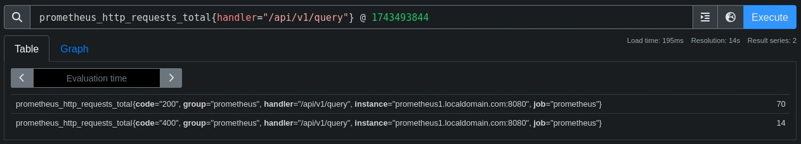
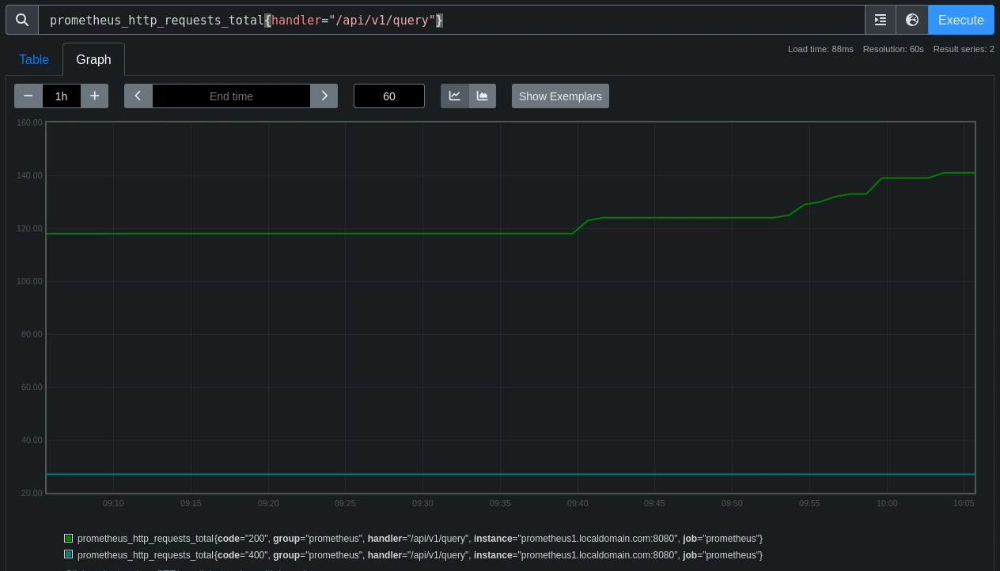

Unlike SQL, that tends to be more imperative (`SELECT ... FROM ...`), the Prometheus Query Language is a nested functional language. That means that you describe the data you are looking for as a nested set of expressions that each evaluate (without side effects) to an intermediary value. Each intermediary value is used as an argument or operand of the expressions surrounding it, while the outer-most expression of your query represents the final return value that you get to see in a table, graph, or similar use case.

## Data model

The data model of Prometheus is simple: it stores numeric time series. Each time series has an identity (its metric name and a unique set of `key="value"` label pairs that create dimensionality within that metric name) and a resulting set of samples. Each sample has a 64-bit integer (UNIX timestamp in milliseconds) and a 64-bit float sample value (even if it just contains an integer value).

To illustrate this, let's take the following query as an example:

```promql
prometheus_http_requests_total{code="200", handler="/metrics"} →
  [@1743324977 → 15469, @1743324992 → 15470]
```

In this visual representation of one series we can identify the following parts:

| Name                   | Component                                                        |
|------------------------|------------------------------------------------------------------|
| Time series identifier | `prometheus_http_requests_total{code="200", handler="/metrics"}` |
| Metric name            | `prometheus_http_requests_total`                                 |
| Labels                 | `code="200"`, `handler="/metrics"`                               |
| Label names            | `code`, `handler`                                                |
| Label values           | `200`, `/metrics`                                                |
| Samples                | `[@1743324977 → 15469, @1743324992 → 15470]`                      |

In queries, we either want to select the latest sample of a set of series at a given query step, or a historical range of samples to aggregate over in some way.

## Anatomy of a query

Let's take the following query as an example:

```promql
histogram_quantile(0.5,
    sum by(le, handler) (
        rate(
            prometheus_http_request_duration_seconds_bucket{
              job="prometheus"
            } [1h]
        )
    )
)
```

In this example, from the inside out:

* `prometheus_http_request_duration_seconds_bucket{job="prometheus"}[1h]` selects the histogram bucket time series[^1] for request durations of the available handlers over the last 1 hour.
* `rate(... [1h])` computes the per-second rate of increase of observations in each bucket over the last 1 hour. Since histogram buckets are implemented as cumulative counters, `rate()` is needed to determine how frequently requests fall into each duration bucket.
* `sum by(le, handler) (...)` aggregates the per-second rate of observations per bucket (`le`[^2]) and per HTTP verb (`handler`). This ensures that the histogram remains grouped by handler while summing rates across multiple instances, if applicable.
* `histogram_quantile(0.5, ...)` computes the 0.5 quantile using the aggregated histogram. The function interpolates an approximate quantile value based on the rate-distributed histogram data.

[^1]: The `_bucket` suffix is a Prometheus naming convention to get the per-bucket time series data.
[^2]: Each bucket in the histogram is described by a label called `le`, which is a canonical abbreviation for *less than or equal*. Therefore, the value of this label encodes the upper inclusive bound for the corresponding histogram bucket. 

> Note: The φ-quantile is the observation value that ranks at number φ × N among the N observations. The 0.5-quantile is known as the median. The 0.90-quantile is the 90th percentile.

A [*](PromQL) expression is not just the entire query, but any nested part of a query that you could run as a query by itself.

## Typed expressions

There are two types to be considered:

* The [type of a metric](), as reported by a scraped target: counter, gauge, histogram, summary, or untyped.
* The [type of a expression](https://prometheus.io/docs/prometheus/latest/querying/basics/#expression-language-data-types): string, scalar, instant vector, or range vector.

[*](PromQL) only takes into consideration expression types. Each expression has a type and each function and operator requires its arguments to be of certain expression type.

Example functions, in alphabetic order, grouped by argument type:

| Function               | Argument type                  | Evaluates to   | Description                                         |
|------------------------|--------------------------------|----------------|-----------------------------------------------------|
| `avg_over_time()`      | Range vector                   | Instant vector | Calculates average over time range                  |
| `count_over_time()`    | Range vector                   | Instant vector | Counts samples over time range                      |
| `rate()`               | Range vector                   | Instant vector | Calculates per-second average rate of increase      |
| `histogram_quantile()` | Instant vector                 | Instant vector | Calculates quantiles from histogram buckets         |
| `sort()`               | Instant vector                 | Instant vector | Sorts vector elements by value (ascending)          |
| `sum()`                | Instant vector                 | Instant vector | Adds all values in the vector                       |
| `clamp_max()`          | Instant vector, Scalar         | Instant vector | Limits vector values to maximum                     |
| `vector()`             | Scalar                         | Instant vector | Converts scalar to single-element vector            |

Example operators, in no particular order:

| Operator | Argument type                  | Evaluates to   | Description                                 |
|:--------:|--------------------------------|----------------|---------------------------------------------|
| `+`      | Instant vector, scalar         | Instant vector | Adds scalar to each vector element          |
| `and`    | Instant vector, instant vector | Instant vector | Returns elements that exist in both vectors |
| `%`      | Scalar, Scalar                 | Scalar         | Modulo operation on scalars                 |
| `>`      | Instant vector, Scalar         | Instant vector | Returns elements greater than scalar        |
| `==`     | Instant vector, Instant vector | Instant vector | Returns elements with equal values          |

In short:

* Scalars are single numeric values.
* Instant vectors are sets of time series with a single sample at the current time
* Range vectors are sets of time series with multiple samples over a specified time window

String values appear in [*](PromQL) in two main contexts:

* As label values in time series, e.g., `{code="200", handler="/metrics"}`, or in label matchers, e.g., `prometheus_http_requests_total{handler=~"^/api.*"}`.
* As arguments to certain functions, e.g. `label_replace(up, "host", "$1", "instance", "(.*):.*")`.

### Example queries

Examples of queries returning scalar values:

| Type           | Example query                                             | Example value |
|----------------|-----------------------------------------------------------|---------------|
| Scalar         | `prometheus_http_requests_total{handler="/metrics"}`      | 11812         |
| Scalar         | `prometheus_tsdb_data_replay_duration_seconds`            | 2.198086471   |

Exmaple query returning an instant vector:

```promql
prometheus_http_requests_total > 0  →
  {code="200", handler="/ready"} → 7
  {code="200", handler="/api/v1/query"} → 39
  {code="200", handler="/graph"} → 3
  {code="200", handler="/metrics"} → 15452
  {code="400", handler="/api/v1/query"} → 11
```

This instant vector is made up of five time series elements, where each element includes a set of labels (in this case, `code` and `handler`) and a scalar value. Functions that accept an instant vector as input would take this entire set as a single argument.

Example query returning a range vector:

```promql
prometheus_http_requests_total{code="400"} [1m]  →
  {handler="/api/v1/query"} →
    [
      @1743324977 → 3,
      @1743324992 → 3,
      @1743325007 → 3,
      @1743325022 → 3
    ]
  {handler="/api/v1/query_range"} →
    [
      @1743324977 → 15469,
      @1743324992 → 15470,
      @1743325007 → 15471,
      @1743325022 → 15472
    ]
```

This range vector is made of two time series elements, each consisting of a set of labels (in this case, `handler`) and a series of timestamp/value pairs showing how the metric changed over the specified 1-minute time range.

When a function such as `rate()` accepts a range vector as input, it takes this entire structure as a single argument and processes all the time series and their timestamp-value pairs to produce a result (which would typically be an instant vector).

## Types of queries

In [*](PromQL), time parametres are sent separately from the expression to the [Prometheus Query API](https://prometheus.io/docs/prometheus/latest/querying/api/), and the exact time parameters depend on the type of query you are sending. Time parametres can be a time range or a timestamp, therefore Prometheus knows two types of [*](PromQL) queries: instant queries and range queries.

### Instant queries

[Instant queries](https://prometheus.io/docs/prometheus/latest/querying/api/#instant-queries) are used for table-like views, where you want to show the result of a query at a single point in time. They have the following parameters:

* The [*](PromQL) expression.
* An evaluation timestamp.

The expression is evaluated at the evaluation timestamp and it can return any valid [*](PromQL) expression type, i.e., strings, scalars, instant vectors and range vectors.

Example query:

```promql
prometheus_http_requests_total{handler="/api/v1/query"}
```

Because it is not provided, the evaluation timestamp in this query is `now`. The selector `prometheus_http_requests_total` is an instant vector selector that selects the latest, non-stale[^3] sample for any time series with the metric name `prometheus_http_requests_total`. Note that both the selector and the metric have the same name.

[^3]: The stale marker is an explicit way of marking a series as terminating at a certain time in the time-series database.

The expression returns a instant vector with two series with a single sample each:

```console
{code="200", handler="/api/v1/query"} → 68 
{code="400", handler="/api/v1/query"} → 12  # yellow
```

The output timestamp of each returned sample is not the timestamp when the sample was taken, but gets set to the evaluation timestamp of the query. That is, if the two samples above, which are the last available ones, were taken 36 seconds ago, they will be presented as taken at the moment of the query execution, i.e., `now`.

We can specify the evaluating timestamp as part of the query. This allows you to query metrics at a specific point in time rather than the current time. The format is `<vector_selector> @ <timestamp>`, where `<timestamp>` is a UNIX timestamp (seconds since epoch).

Example query:

```promql
prometheus_http_requests_total{handler="/api/v1/query"} @ 1743493844
```

We can see this output on the `Table` tab of the Prometheus web UI.



### Range queries

[Range queries](https://prometheus.io/docs/prometheus/latest/querying/api/#range-queries) are mostly used for graphs, where you want to show an expression over a given time range. They have the following parameters:

* The PromQL expression.
* A start time.
* An end time.
* A resolution step.

After evaluating the expression at every resolution step between the start and end time, the individually evaluated time slices are stitched together into a single range vector. Accessing a window of past data is often useful for computing aggregates like rates or averages over a period of time.

Range queries always return a range vector (the result of the scalar or instant vector being evaluated over a range of time).

You write range vector selectors exactly like instant vector selectors, but with the desired time range window appended in square brackets. Including a time unit is mandatory. The available units are `ms` (milliseconds), `s` (seconds), `m` (minutes), `h` (hours), `d` (days), `w` (weeks) and `y` (years).

Example query:

```promql
prometheus_http_requests_total{handler="/api/v1/query"} [1h]
```

We can see this output on the `Graph` tab of the Prometheus web UI (resolution is set to `60s`):



## Selectors vs queries

As you may have already figured out from the sections above, the terms *instant* and *range* are used both for:

1. The type returned by an entire [*](PromQL) query.
2. The type of an individual selector within a [*](PromQL) query.

This can be confusing.

### Selectors

Given that there are two types of vectors, instant and range, we have two types of selectors, instant vector selectors and range vector selectors.

* An **instant vector selector** allows you to select the latest sample value at an evaluation timestamp when in an instant query, or at every evaluation step   when in a range query.

  It is called a vector selector because it returns a set, or vector, of time series, with one sample for each series (thus, an instant vector).
  
  An example of an instant vector selector would be `prometheus_http_requests_total`.

* A **range vector selector** allows you to select an entire range of samples over time, at each evaluation step[^4] of a query. This allows you to run aggregations over the time window: rates of increase, averages, min/max values, quantiles, and so on. 

  You write range vector selectors exactly like instant vector selectors, but with the desired range time window appended in square brackets. For example, `prometheus_http_requests_total [1h]`.

[^4]: The number of evaluation steps is determined by the resolution of the query.

### Queries

This concept is about the overall query execution, and whether a query as a whole is evaluated at a single timestamp (instant), or at multiple subsequent time steps (range).

## Lookback delta

An instant vector selector serves the use case of "give me the latest sample value at a given time for a set of series". However, this requires defining "latest".

Since samples can have arbitrary timestamps (e.g., due to different scrape interval), there is no fixed interval between samples in Prometheus. Therefore, knowing whether there is a "current" latest samples for a given series is difficult. If the latest sample for a given series is days or weeks old, it is most probably not meaningful as part of the result of an instant vector selector at the current timestamp, as it would lead to many outdated series "flatlining" in a graph.

However, samples are not expected to exactly match the evaluating timestamp either. So, some kind of middle ground is needed.

To select latest samples that are neither too outdated, nor require super fast scrape intervals, or even grid-aligned sample timestamps, in Prometheus instant vector selectors look back a maximum of 5 minutes relative to the evaluation timestamp, meaning older samples are dropped from the result.

## Staleness

Despite the 5-minute rule above being a good compromise between excluding old data and including recent-enough samples, it will never cover all use cases. Thus, Prometheus supports explicitly marking series as stale.

When Prometheus detects that a series will go extinct (e.g., its target has disappeared, its target no longer returns it, or a recording rule stopped returning it), Prometheus writes out an explicit staleness marker for this series, which is internally signaled with a `NaN` sample value.

When instant vector selectors encounter a staleness marker as the last-seen sample value before their evaluation timestamp, the corresponding series will not be included in the result. This solves the "double count" and "flatlining" issues more quickly.

## Learning by doing

At this point in the series we are only monitoring our own Prometheus server, so the [list of available metrics]() is relatiely small. However, [*](PromQL) offers a huge range of functions and operators, and delving into them takes time and practice.

You can check the full list of [operators](https://prometheus.io/docs/prometheus/latest/querying/operators/) and [functions](https://prometheus.io/docs/prometheus/latest/querying/functions/) in the [official PromQL guide](https://prometheus.io/docs/prometheus/latest/querying/). Moreover, [PromLabs](https://promlabs.com/) offers a [PromQL cheat sheet](https://promlabs.com/promql-cheat-sheet/).

While you do that, you may want to go through the following list of example queries, sorted by complexity, so you learn by doing.

### Basic metric selection

Shows raw counter values of all HTTP requests handled by Prometheus, broken down by handler and status code. This introduces the fundamental concept of metric inspection.

```promql
prometheus_http_requests_total
```

### Filtered metric selection

Filters HTTP requests to only show traffic hitting the `/metrics` endpoint. Demonstrates label filtering with `{}`.

```promql
prometheus_http_requests_total{handler="/metrics"}
```

### Counter rate calculation

Calculates the per-second request rate over 1-hour windows. Introduces the `rate()` function for counter metrics.

```promql
rate(prometheus_http_requests_total[1h])
```

### Aggregation with sum

Aggregates total HTTP requests by status code. Introduces the `sum()` and `by` operators for dimensional analysis.

```promql
sum(prometheus_http_requests_total) by (code)
```

### Error rate percentage

Calculates the percentage (`%`) of HTTP requests that resulted in client or server errors over 1 hour. Combines filtering, `rate()`, and arithmetic operations.

```promql
sum(
  rate(
    prometheus_http_requests_total{code=~"4..|5.."}[1h]
  )
) / 
sum(
  rate(
    prometheus_http_requests_total[1h]
  )
) * 100
```

In the numerator of this example, from the inside out:

* `{code=~"4..|5.."}` uses a regular expression to filter HTTP requests with 4xx or 5xx status codes. This isolates error responses from the `prometheus_http_requests_total counter`.
* `rate(...[1h])` computes the per-second rate of errors (i.e., the error rate) over a 1-hour window. `rate()` handles counter resets and extrapolates gaps, making it ideal for transient metrics like HTTP requests.
* `sum(...)` aggregates (i.e., sums) the error rates across all handlers (e.g., `/metrics`, `/api`). Without this, the result would show per-handler error rates instead of the global error rate.

The denominator repeats the `rate()` calculation but without filtering, giving the total request rate across all status codes. This ensures the denominator represents the total workload against which errors are compared.

Finally, we multiply by 100 to express the ratio as a percentage.

Some important considerations:

* Counters require `rate()`. Direct counter values (e.g., `prometheus_http_requests_total`) are meaningless without normalization over time.
* Aggregation is critical. Summing ensures the result reflects system-wide health, not individual endpoints.
* Regex filtering: `4..` and `5..` efficiently capture all 4xx and 5xx errors, respectively, without listing each code (`400`, `401`, `500`, `503`, etc).

### Memory usage

Displays the resident memory used by the Prometheus process. Introduces system-level metrics.

```promql
process_resident_memory_bytes{job="prometheus"}
```

### Garbage collection impact

Shows the time spent in garbage collection per second over 1 hour. Highlights Go runtime metrics and their impact.

```promql
rate(go_gc_duration_seconds_sum{job="prometheus"}[1h])
```

### Latency percentiles

Calculates the 95th percentile latency for HTTP requests using histogram metrics. Introduces `histogram_quantile()` for performance analysis.

```promql
histogram_quantile(0.95,
  rate(
    prometheus_http_request_duration_seconds_bucket[1h]
  )
)
```

### Top 5 busiest handlers

Identifies the 5 most frequently accessed endpoints using `topk()`. Combines aggregation and ranking.

```promql
topk(5, 
  sum(
    rate(
      prometheus_http_requests_total[1h]
    )
  )
  by (handler)
)
```

### Scrape duration analysis

Averages scrape durations per job over 1 hour. Demonstrates working with custom metrics like `prometheus_target_interval_length_seconds`.

```promql
avg(
  rate(
    prometheus_target_interval_length_seconds_sum[1h]
  )
) 
by (scrape_job)
```

### Disk usage prediction

Predicts TSDB storage usage in 7 days using linear regression. Introduces time-series forecasting with `predict_linear()`.

```promql
predict_linear(
  prometheus_tsdb_storage_blocks_bytes[6h], 3600*24*7
)
```

### Memory pressure alert

Triggers when memory usage exceeds 80% of the available limit. Combines arithmetic operations and threshold comparison.

```promql
(process_resident_memory_bytes / process_virtual_memory_max_bytes) * 100 > 80
```

### Target health status

Shows health status (`1` equals healthy, `0` means unhealthy) of all scrape targets. Uses the synthetic `up` metric for monitoring reliability.

```promql
up{job=~".+"}
```

As we add more targets along this series of articles, this query will yield more results.

### Goroutine leak detection

Alerts when the number of active Goroutines exceeds 1000. Highlights Go runtime concurrency metrics.

```promql
go_goroutines{job="prometheus"} > 500
```

### Composite query: GC vs. CPU

Compares CPU time spent in garbage collection (GC) vs. total CPU usage, i.e., how much CPU is wasted on GC. Combines multiple metrics and demonstrates ratio analysis.

```promql
rate(
  go_gc_duration_seconds_sum{job="prometheus"}[1w]
) / 
rate(
  process_cpu_seconds_total{job="prometheus"}[1w]
) * 100
```

In the numerator of this example, from the inside out:

* `go_gc_duration_seconds_sum` is a counter tracking cumulative time spent in garbage collection (GC).
* `rate(...[1w])` computes the per-second average time spent in GC over a 1-week window (e.g., a rate of 0.05 would mean 0.05 seconds of GC per second, i.e., 5% of a CPU core).

Then, in the denominator:

* `process_cpu_seconds_total` is a counter tracking cumulative CPU time used by the Prometheus process.
* `rate(...[1w]) converts this into per-second CPU utilization (e.g., 0.8 means 80% CPU usage).
        
Finally, to compute GC as percentage (`%`) of CPU:

* Dividing GC time per second by CPU usage per second gives the fraction of CPU time spent on GC.
* Multiplying by 100 converts this to a percentage.

For example, if GC time were to be 0.000001 and CPU usage were to be 0.066732, the result would be `(0.000001 / 0.066732) * 100 = 0.002%`. This would mean that 0.002% of CPU time is spent on garbage collection.

Some important considerations:

* Counters require normalization. Both metrics use `rate()` to convert counters into per-second rates, ensuring comparability.
* Actionable insight. A high percentage (e.g., `> 0.01%`) could indicate inefficient memory usage or excessive allocations.
