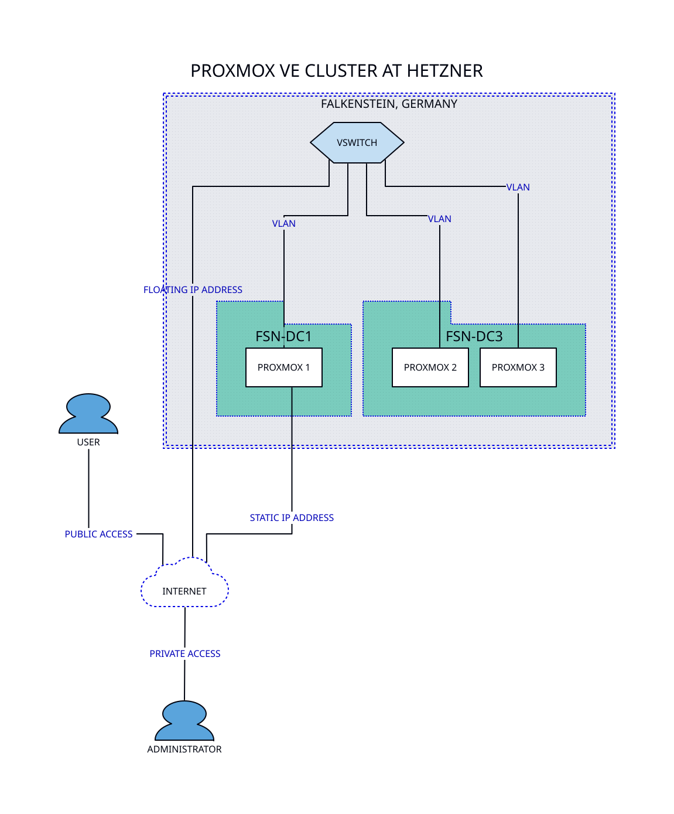

## Introduction

This series of articles will take you through the steps required to install and manage a basic [Proxmox Virtual Environment](https://www.proxmox.com/en/proxmox-ve) cluster on dedicated servers at [Hetzner](https://www.hetzner.com/), a German hosting company and data centre operator. It is an entry level proposal aimed at companies or individuals that want to self-host the software required to run their business.

If you have never read about Proxmox before, I suggest that you go through the excellent [Migrate to Proxmox VE](https://pve.proxmox.com/wiki/Migrate_to_Proxmox_VE) article on their website, which explains the core concepts very well.

We will start with a simple setup of three nodes that will make use of a subset of the features Proxmox offers. As we progress through the series, we will gradually introduce more advanced features, while keeping it very cost-effective and affordable.

## Hardware

Hetzner offers a wide range of servers, and also accepts custom orders. The specifications of the nodes will dictate certain configuration aspects and which features of Proxmox are used. Price will vary substantially depending on what you order, hence planning before ordering is a must.

Generally speaking:

* The more [*](CPU) cores you have, the more tasks the kernel will be able to run in parallel.
* The bigger your disks, the more capacity your local or shared storage will have in a given node and, overall, in the cluster.
* The amount of [*](RAM) will limit both the amount of guests per node and the amount of memory you will be able to assign to them.
    
How much you need of each heavily depends on the load you plan on running in the cluster.

## Design considerations

Let's give some thought to the network configuration before getting started. We will be following the naming conventions for device names described in the [Host System Administration > Network Configuration](https://pve.proxmox.com/pve-docs/pve-admin-guide.html#sysadmin_network_configuration) section of the [Proxmox VE Administration Guide](https://pve.proxmox.com/pve-docs/pve-admin-guide.html).

Virtual switches allow your guests (containers and virtual machines) to use the same [*](IP) address anywhere in the cluster, allowing them to be migrated from node to node without the need to change their configuration. 

Private subnets through virtual switches are included by default, without any additional cost. However, you will need to [purchase a subnet of public IP addresses](https://docs.hetzner.com/general/others/ipv4-pricing#vswitch-ipv4-products) if you plan on using floating public [*](IP) addresses on (some of) your guests, e.g. an LXC running a HTTP reverse proxy.

All guests on your cluster will have a `net0` virtual network device with an [*](IP) address of the private network `192.168.0.0/16` via the `vmbr4002` bridge.

Some guests will also have a `net1` virtual network device with an [*](IP) address of the floating public subnet assigned to the vSwitch via the `vmbr4001` bridge. More on that later on this series.

| Proxmox name | OS name on LXC | OS name on VM |
|--------------|----------------|---------------|
| `net0`       | `eth0`         | `ens18`       |
| `net1`       | `eth1`         | `ens19`       |

All nodes will communicate through the `10.0.0.0/24` subnet. If you do not plan on using Docker, you may want to switch to the `172.16.0.0/24` subnet.



We will use the static public IP address assigned to each dedicated server for administration purposes, e.g., SSH access.

Through the [WebGUI](https://pve.proxmox.com/wiki/Graphical_User_Interface) you will be able to change the [*](OS) name of a network device when working with [*](LXC). When working with a [*](VM), Proxmox assigns each [*](VirtIO) [*](NIC) on different virtual PCI slots (e.g., `ens18` equals to the ethernet card on the PCI slot 18[^1]). Use the `ip link show` command [^2] to list the available network devices in a [*](VM).

[^1]: When dealing with [predictable network interface names](https://www.thomas-krenn.com/en/wiki/Predictable_Network_Interface_Names), your mileage may vary.
[^2]: Alternative commands are `netstat -i` and `ifconfig -a`.

We will be using two fake domain names: `localdomain.com` and `publicdomain.com`. The former will be used internally, within the cluster [^3], to resolve the hostnames of the guests, and the latter will be used externally, via the public Domain Name System.

[^3]: Later on this series we will install and configure [PowerDNS](https://www.powerdns.com/).

## Basic setup

The basic setup consists of three or more dedicated servers with minimum specifications and three virtual switches. You do not need to place a custom order for this. You can order the servers from the [Hetzner Server Auction](https://www.hetzner.com/auction) page or from the [Hetzner Dedicated Servers](https://www.hetzner.com/dedicated-rootserver) page, depending on your needs. 

| Name  | Description                                | Notes    |
|-------|--------------------------------------------|----------|
| CPU   | Intel or AMD, 8+ cores                     |          |
| Disks | 2x NVMe SSD for the OS and local storage   | RAID 1   |
| Disks | 2x HDD for local storage, using ZFS mirror | Optional |
| RAM   | 64+ GB                                     |          |
| NIC   | 1 Gbps, the default with any server        |          |

With this basic hardware configuration you will have your only [*](NIC) handle the traffic to the Internet as well as the traffic among nodes and among guests, with the help of three [virtual switches](https://docs.hetzner.com/robot/dedicated-server/network/vswitch/).

This type of setup will be fairly easy to manage and will have a very low setup and maintenance cost. However, you will have neither shared storage nor high availability. [*](RAID) 1 on your [*](SSD)-based local storage will provide fault tolerance and increased read performance.

More importantly, you will only be able to have a maximum of 30 guests per node due to the *artificial* limit of 32 [*](MAC) addresses per switch port that Hetzner has on vSwitches.

| Type            | Device name | Used by  | Type           | IP range         | Description                                             |
|-----------------|-------------|----------|----------------|------------------|---------------------------------------------------------|
| Ethernet device | `eno1`      | The host | Public IP      |                  | Public IP address assigned to the server when ordered   |
| Bridge          | `vmbr4001`  | Guests   | Public subnet  |                  | Public subnet assigned to the vSwitch with id 4001      |
| Bridge          | `vmbr4002`  | Guests   | Private subnet | `192.168.0.0/16` | Communication among guests through vSwitch with id 4002 |
| VLAN            | `eno1.4003` | Hosts    | Private subnet | `10.0.0.0/24`    | Communication among nodes through vSwitch with id 4003  |

## Types of nodes

All nodes in this basic setup will be of mixed type, that is, will have local storage for guests (same [*](NVMe) disks where the [*](OS) was installed or on separate [*](HDD) disks with ZFS) and will run applications, e.g., a Django web application or a PostgreSQL server.

## Creating the vSwitches

[Virtual switches](https://docs.hetzner.com/robot/dedicated-server/network/vswitch/) are a feature of Hetzner Online that allows you to create virtual layer 2 networks, enabling communication between your dedicated servers across different locations. This is particularly useful for creating a Proxmox cluster where multiple nodes need to communicate with each other and with the guests running on them.

Log in at [Hetzner's accounts page](https://accounts.hetzner.com/), then navigate to [Hetzner Robot](https://robot.your-server.de/) > [Servers](https://robot.hetzner.com/server) > [vSwitches](https://robot.hetzner.com/vswitch/index). Use the `Create vSwitch` button to create up to three virtual switches, depending on your setup.

| Name                           | VLAN id | Notes            | Cost                   |
|--------------------------------|:-------:|------------------|------------------------|
| Proxmox guests public network  | `4001`  |                  | Ordered separately[^1] |
| Proxmox guests private network | `4002`  | `192.168.0.0/16` | Free of charge         |
| Proxmox hosts private network  | `4003`  | `10.0.0.0/24`    | Free of charge         |

[^1]: [Pricing](https://docs.hetzner.com/general/others/ipv4-pricing/#colocation).

Then add all the servers to each vSwitch using the `Virtual switch > Add servers to vSwitch` option inside each virtual switch you just created.

## Ordering a subnet of public IP addresses

We need to order an additional subnet of public IP addresses for the guests that will require them. Select the vSwitch with VLAN id `4001` and click on the `IPs` tab, then click on the `Order additional IPs/Nets` button.

* Choose your preferred subnet size.
* Type in something like "Floating IPs for Proxmox cluster" in the `Purpose of use` field.
* Agree to the terms and conditions.
* Click on the `Apply for subnet in obligation` button.

Once the order has been processed, you will be able to assign the additional IPs to the guests.

| Mask (bits) | Decimal notation  | No. of IPs | Usable IPs |
|:-----------:|-------------------|:----------:|:----------:|
| `27`        | `255.255.255.224` | 32         | 30         |
| `28`        | `255.255.255.240` | 16         | 14         |
| `29`        | `255.255.255.248` | 8          | 6          |

> For reference, in this series we will be using a fake `v4.public.ip.subnet/28` subnet, with fake IP addresses like `v4.public.ip.1`, `v4.public.ip.2`, etc.

## IPv6

To keep things as simple as possible, we will not be using IPv6 in this series, but you could order a subnet of IPv6 addresses in the same way as you did for IPv4. The subnet would be assigned to the `vmbr4001` bridge, which is the public network of the guests.

You will see that Hetzner assigns IPv6 addresses to servers in addition to IPv4 ones. Keep in mind that `::` is the IPv6 equivalent of `0.0.0.0` in IPv4. `::1` is IPv6 equivalent of `127.0.0.1` (the loopback address) in IPv4.

## Counting MAC addresses

There are a few limitations to keep in mind when using Hetzner's vSwitches, the most important being that there is a limit of 32 MAC addresses per physical switch port. This means that we will not be able to use more than 30 guests per host, provided that each guest has just one (private) IP address.

Use the following script to calculate the number of MAC addresses used in each node:

```bash
#!/bin/bash
# Count the number of MAC addresses in the node

total=0

for bridge in $(ip link show | awk -F: '/vmbr/ && !/fw/{print $2}'); do
  count=$(ip link show | grep -A 1 "master $bridge" | grep 'link/ether' | awk '{print $2}' | sort -u | wc -l)
  total=$((total + count))
done

echo "$total"
```

This script will count the number of unique MAC addresses associated with each bridge interface that starts with `vmbr`, excluding any interfaces that contain `fw` (which are typically firewall-related interfaces in Proxmox).

Some considerations regarding the total amount of MAC addresses you may see when running `ifconfig -a` or `ip link show`:

* **Bridge Interface**: The bridge itself has a MAC address, which is included in the count.
* **Virtual Interfaces**: Each VM or LXC connected to the bridge has a virtual interface (e.g., `veth*` or `tap*`) with a MAC address.
* **Firewall Interfaces**: The `fwpr*` and `fwln*` interfaces do not contribute to the MAC address count because they are internal to Proxmox.
