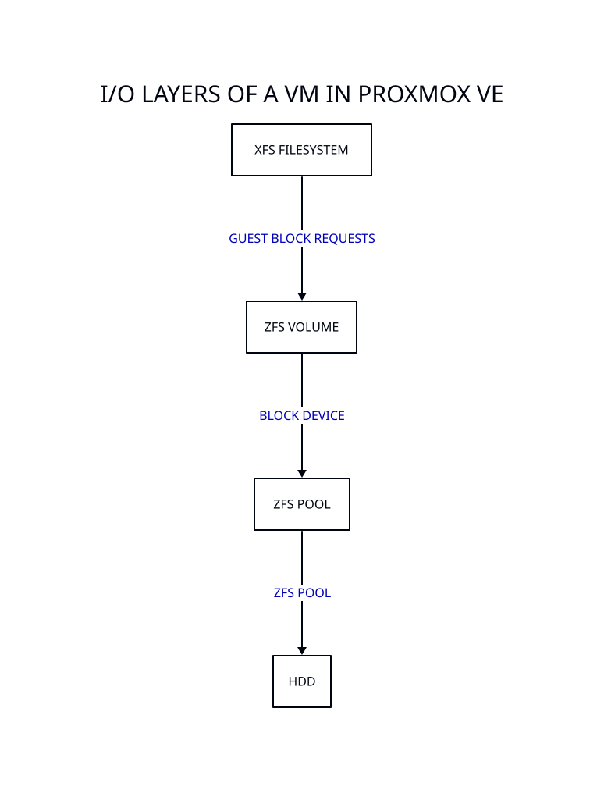



In previous articles of this series we have seen [how to set up an NFS server]() on a [*](VM) on Proxmox, and [how to extend the disks]() used by that VM. For that, we used default values for the block sizes of the different layers involved in the I/O operations, which are:

* A ZFS storage pool made of two HDD in mirror mode, with `ashift=12` (4096 bytes).
* A ZFS volume (ZVOL) for our data disk, with `volblocksize=8K`.
* An XFS filesystem on the data disk of the VM, with `data.bsize=4096`.

In this article we will focus on the block sizes of the different layers involved in the I/O operations of our NFS server.

Generally speaking, the easiest way to improve performance, minimise fragmentation, and make the most of our disk's physical layout is:

1. To align the physical sector size of our disk with the block size of our ZFS storage pool.
2. To align the block sizes of the ZVOL and the filesystem inside the VM.

For that, we need to gather relevant statistics that allow us to make informed decisions.

> ZFS ARC caching can affect the observed I/O patterns, especially for read workloads.

## Current situation

If you followed the steps described in the [NFS server on Proxmox VE]() article in this series, using Debian 12 Bookworm, at the moment you ought to have the following sector and block sizes:

| Layer                | Option name    | Value  | Command                                     |
|----------------------|:--------------:|:------:|---------------------------------------------|
| Physical sector size | `PHY-SEC`      | 4096   | `lsblk -o NAME,SIZE,PHY-SEC,LOG-SEC`        |
| ZFS storage pool     | `ashift`       | 12[^1] | `zdb -C zfspool \| grep ashift`             |
| ZVOL                 | `volblocksize` | 8K     | `zfs get volblocksize zfspool/vm-104-data`  |
| XFS                  | `data.bsize`   | 4096   | `xfs_info /dev/sdc`                         |

[^1]: 2¹² = 4096 bytes.

Default values of `ashift` and `volblocksize` may differ depending on your hardware, the version of Proxmox you are using, and the version of ZFS it ships with. For instance, ZFS version 2.2 brings in a new default block size of 16K.

> Most modern SSDs, particularly enterprise-grade ones, use 8KB logical sectors.

While the table above shows a disparity in the block size of our ZVOL, this is fine for most use cases. Furthermore, the specifics of each filesytem need to be considered in the equation. In the case of the ZVOL, setting `volblocksize` down to 4K most probably would not make it perform better because ZFS operates a lot of metadata, therefore the data-to-metadata ratio would be worse.

> ZFS does not mix metadata and file data in the same `volblocksize` block, so metadata always incurs its own overhead, no matter how small the file is.

For example, with `ashift=12` (i.e., 4K sector alignment) and the default `redundant_metadata=all`, ZFS writes two copies of metadata for redundancy. If the ZVOL has a `volblocksize=8K`, writing 8K of user data results in 1 × 8K data block and 2 × 4K metadata blocks (each redundant), for a total of 16K written.

However, if `volblocksize=4K`, writing the same 8K of user data as two separate 4K writes results in 2 × 4K data blocks and 4 × 4K metadata blocks (2 per data block, due to redundancy), for a total of 24K written.

## ZFS storage pool

This terminology is used to describe the grouping of storage devices (HDD, SSD, etc.) into a single logical unit using the ZFS file system.

The `ashift` parametre controls the minimum block size ZFS will use for physical I/O on disk. Our HDD has a physical sector size of 4096 bytes, thus setting `ashift=12` (4096 bytes) is fine.

However, using `ashift=13` (8192 bytes) can still be a good idea when working with workloads with larger I/O (like our NFS server), which can benefit from the reduced metadata overhead and fewer IOPS required.

Regarding the value of `ashift` used when creating a ZFS pool, Proxmox offers a recommended value on the WebGUI which depends on the logical sector size of the disks. A general guideline would be:

* `ashift=9` for older HDD disks with 512-byte sectors.
* `ashift=12` for newer HDD disks with 4KB sectors.
* `ashift=13` for SSD disks with 8KB sectors.

> Once a ZFS vdev is created with a specific `ashift` value, it cannot be changed.

## Write amplification

Write amplification in ZFS refers to the phenomenon where the file system ends up writing more data to the storage device than the amount of data originally intended to be written by the user or application.

$$
  \text{Write amplification} = \frac{\text{Physical bytes written to storage}}{\text{Logical bytes written by the application}}
$$

This can happen because ZFS is a copy-on-write (COW) file system and uses a larger record size than the data being written, requiring it to rewrite larger blocks even when only a small portion of the data needs to be changed.

But how does write amplification happen? Suppose our NFS server performs plenty of 8K writes at a time and our ZFS pool has `ashift=12` (4K). Then, ZFS tries to write 2 × 4K blocks (to match 8K) but, due to misalignment or COW, it might read-modify-write more 4K blocks than needed, leading to write amplification.

If `ashift=13` (8K), then ZFS treats each 8K write as one atomic block. This leads to better alignment with our I/O patterns (writing 8K at a time), less overhead, less fragmentation, and less metadata churn.

Therefore, even though our HDD disk sectors are 4K, aligning ZFS to 8K avoids extra work when the application's write size exceeds 4K.

In conclusion, if we observe, or predict, I/O patterns happening mostly in the range of 8K-16K, we are better off creating our ZFS storage pool with an `ashift` value of 13 instead of the default 12 offered by the WebGUI.

## Measuring

Choosing a bigger block size when formatting a filesystem can offer a performance sweet spot for workloads that commonly read or write in chunks larger than the standard 4K.

However, as with any optimisation, the effectiveness of using 8K+ blocks ultimately depends on the typical request sizes and access patterns in your environment, and the specifics of the filesystem. So, how do we figure it out?

We are mostly interested in historical I/O stats, not real time. And because we have different layers involved, we need to measure at each level.



### At the host level

Using the terminal at the host (the Proxmox node), we can observe logical and physical I/O stats of our ZFS storage pool, including metadata and ZFS overhead (checksumming, compression, etc.) of all ZVOLs and datasets underneath.

To see logical I/O stats, we can use the `zpool iostat` command from the `zfsutils-linux` package. The output table shows the average request size, including ZFS metadata overhead (not just raw application reads/writes), since boot.

```bash
zpool iostat -r zfspool
```

Although not essential in calculating the right `volblocksize` of our ZVOL, it is convenient to understand the suffixes and prefixes being used in the output table.

Regarding the `ind` and `agg` suffixes:

| Suffix | Short for  | Meaning                  | Example                                                                |
|:------:|------------|--------------------------|------------------------------------------------------------------------|
| `ind`  | Individual | Average size of each I/O | `sync_read_ind` tells the average size of each synchronous read        |
| `agg`  | Aggregate  | Total bytes per second   | `sync_read_agg` is the total bandwidth of synchronous reads per second |

And regarding the `sync` and `async` prefixes.

| Type        | Meaning                                                   | Use case or trigger                             |
|-------------|-----------------------------------------------------------|-------------------------------------------------|
| Sync read   | App waits until data is fetched from disk                 | `O_DIRECT`, explicit `fsync`, or uncached reads |
| Async read  | OS can prefetch or return from cache                      | Normal file reads, when data is in memory       |
| Sync write  | Data must be committed to stable storage before returning | Database commits, `fsync()`, `fdatasync()`      |
| Async write | OS acknowledges write before data hits disk               | Normal buffered writes                          |

Example output of a ZFS storage pool made of two HDD in mirror mode that was created using `ashift=13` (for simplicity, and because trimming is not enabled, the last four columns have been cut out):

```console
# zpool iostat -r zfspool
zfspool       sync_read    sync_write    async_read    async_write
req_size      ind    agg    ind    agg    ind    agg    ind    agg
----------  -----  -----  -----  -----  -----  -----  -----  -----
512             0      0      0      0      0      0      0      0
1K              0      0      0      0      0      0      0      0
2K              0      0      0      0      0      0      0      0
4K          1.87M      0  3.91M      0   217K      0  23.7M      0
8K          54.1M  15.7K  8.99M      0  11.6M  19.8K  17.5M  9.74M
16K         30.5K   396K  2.71M      0  5.06K   602K   948K  8.85M
32K          329K   539K   616K      5   193K   913K  1.64M  5.59M
64K         2.45K   633K   669K      6  1.67K  1.05M   281K  3.57M
128K          221   173K  4.35M  46.2K    621   957K  5.71K  3.82M
256K            0   157K      0  74.8K      0   613K      0  4.16M
512K            0   281K      0   105K      0   648K      0  2.09M
1M              0   280K      0  1.28M      0   671K      0  2.05K
2M              0      0      0      0      0      0      0      0
4M              0      0      0      0      0      0      0      0
8M              0      0      0      0      0      0      0      0
16M             0      0      0      0      0      0      0      0
------------------------------------------------------------------
```

These show counts of I/O operations categorised by I/O size and type (sync/async read/write, scrub and trim). The suffixes `K` and `M` represent kilo and mega, in base 1024.

In addition to `zpool iostat`, given that the ZVOL is exposed as a block device, we can also use `iostat`, from the `sysstat` package, to observe physical I/O statistics in real time:

```bash
iostat -xd /dev/zvol/zfspool/vm-104-data
```

This tool shows kernel block-level I/O to the ZVOL device. Since our ZVOL is used by a VM, this shows how the host handles actual I/O coming from the guest. Relevant columns:

| Column     | Description                         | Units |
|------------|-------------------------------------|:-----:|
| `rareq-sz` | Read average request size           | kB    |
| `wareq-sz` | Write average request size          | kB    |
| `dareq-sz` | Average discard request size        | kB    |
| `f_await`  | Flush request average wait time     | ms    |

ZFS stores data in `recordsize` chunks for filesystems and `volblocksize` for ZVOLs. When guest I/O sizes mismatch `volblocksize`, ZFS must read-modify-write the full block, hurting performance.

If `rareq-sz` and `wareq-sz` are much smaller than the `volblocksize` of our ZVOL, meaning that the VM is issuing small reads/writes, this could increase IOPS load on the pool, result in write amplification and undermine compression and coalescing.

However, if `rareq-sz` and `wareq-sz` are much larger than the `volblocksize` of our ZVOL, meaning that the VM is issuing large read/writes, this would lead to efficient I/O ops, which is good. Larger I/O operations are more efficient and tend to align better with ZFS's recordsize (defaults to 128K). Also, they allow ZFS to compress or dedup data more effectively and reduce write amplification on underlying disks.

```console
# zfs get recordsize zfspool
NAME     PROPERTY    VALUE    SOURCE
zfspool  recordsize  128K     default
```

Additionally, high `f_await` can mean that the VM (our NFS server) is using `fsync()` often, and that our pool is not optimised for synchronous writes, e.g., no Separate LOG (SLOG) device, on a fast NVMe or SSD. This can point to synchronisation bottlenecks.

Example output of the same ZFS storage pool as before (for simplicity, only the four columns mentioned above are included):

```console
# iostat -xd /dev/zvol/zfspool/vm-104-data
Device           rareq-sz  wareq-sz    dareq-sz  f_await
zd16               126.40    277.94  1048576.00     0.00
```

> ZFS stores metadata alongside data, and this overhead is more noticeable when block sizes are small or when fragmentation occurs.

### At the guest level

Next, we need to get closer to the actual workload and its I/O patterns, so we need to measure from within the [*](VM). For that, we can use `iostat` for real-time measuring, and `sar` for historical data, both in the `sysstat` package.

Let's start by using `iostat` for real-time statistics with average request size:

```bash
iostat -xd /dev/sdc
```

Relevant columns:

| Column     | Description                         | Units |
|------------|-------------------------------------|:-----:|
| `rareq-sz` | Read average request size           | kB    |
| `wareq-sz` | Write average request size          | kB    |
| `dareq-sz` | Average discard request size[^2]    | kB    |
| `f_await`  | Flush request average wait time[^3] | ms    |

[^2]: Large discard sizes might suggest benefit from larger block sizes, but they do not usually dominate performance.
[^3]: Tells you how long it takes to flush buffers, but not how big the data chunks are.

For historical data, we need to enable `sar`. Start by editing the `/etc/default/sysstat` configuration file:

```ini
ENABLED="true"
```

And continue by enabling and starting the systemd timer:

```bash
systemctl enable sysstat
systemctl start sysstat
```

The daily files (`saXX`) will start populating (the number matches the day of the month):

```bash
ls -lh /var/log/sysstat/
```

The `sysstat-collect.timer` timer runs every 10 minutes, whereas the `sysstat-summary.timer` runs once a day. Let some time go by, then see the results using the `sar` command:

```bash
sar -d --dev=sdc
```

If you want to check a particular day, use the following command:

```bash
sar -d --dev=sdc -f /var/log/sysstat/saXX
```

You will notice that the default behaviour is to display a list of intervals and a last line with the average. Should you be intersted in a particular moment in time, you can filter the intervals:

```bash
sar -d --dev=sdc -s 00:00:00 -e 23:59:59
```

> In the long run, we are mostly interested in the average.

Relevant columns:

| Column    | Description              | Units |
|-----------|--------------------------|:-----:|
| `tps`     | Transfers per second[^4] |       |
| `rkB/s`   | Read throughput          | kB/s  |
| `wkB/s`   | Write throughput         | kB/s  |
| `dkB/s`   | Kilobytes discarded[^5]  | kB/s  |
| `areq-sz` | Average request size     | kB    |
| `await`   | Average wait time[^6]    | ms    |
| `%util`   | Device utilization[^7]   | %     |

[^4]: An I/O request to a physical device. Multiple logical requests can be combined into a single I/O request.
[^5]: Due to TRIM/UNMAP operations. Often 0 unless on SSDs with discard enabled.         
[^6]: High latency may suggest mismatch in I/O size vs block size.
[^7]: Near 100% could mean saturation. Optimizing block size may help.

>  Throughtput is useful for understanding workload volume, in context with request size.

If most requests are 8 KB or larger, it may make sense to align `volblocksize` and filesystem block size to 8K or more, which reduces write amplification and fragmentation. Conversely, too small blocks increase metadata and IOPS load.

Example output under heavy load:

```console
# sar -d --dev=sdc -s 07:30:00 -e 08:50:00 -f /var/log/sysstat/sa24
07:30:13 AM  DEV     tps     rkB/s  wkB/s  dkB/s  areq-sz  await  %util
07:40:13 AM  sdc  424.57  52524.58   0.00   0.00   123.71   1.82  75.24
07:50:13 AM  sdc  509.13  85059.57   0.00   0.00   167.07   2.15  94.17
08:00:13 AM  sdc  758.21  76511.56   0.00   0.00   100.91   1.39  90.90
08:10:13 AM  sdc  508.45  63185.16   0.00   0.00   124.27   1.61  80.03
08:20:13 AM  sdc  290.09  63357.08   0.00   0.00   218.40   1.69  43.41
08:30:07 AM  sdc  622.21  61181.33   0.00   0.00    98.33   0.85  47.76
08:40:13 AM  sdc  161.86  31132.86   0.00   0.00   192.35   1.81  25.46
Average:     sdc  467.13  61807.10   0.00   0.00   132.31   1.54  65.25
```

## Mapping metrics

A number of metrics can be taken into consideration when tuning block sizes, but these are the most relevant ones:

| Metric               | Why it matters                                                                           | HDD | SSD | Notes                                                                         |
|----------------------|------------------------------------------------------------------------------------------|:---:|:---:|-------------------------------------------------------------------------------|
| Average request size | Helps choose optimal block size at filesystem and ZVOL layers                            | Yes | Yes | Crucial for both, as mismatched sizes reduce throughput or increase latency   |
| IOPS vs bandwidth    | Small, random I/O favours smaller blocks; sequential workloads benefit from large blocks | Yes | Yes | SSDs can handle much higher IOPS than HDDs, but pattern still matters         |
| CPU usage            | Larger blocks may reduce CPU load per byte transferred.                                  | Yes | Yes | Larger I/O sizes reduce syscalls and context switches, benefiting both        |
| Write amplification  | High when block sizes are misaligned                                                     | No  | Yes | Critical for SSDs (due to erase/write cycles)                                 |
| Fragmentation        | Smaller blocks reduce internal fragmentation, but increase metadata overhead             | Yes | No  | HDDs suffer more from fragmentation; SSDs less so but metadata load increases |

Let's try to map these metrics to the output provided by `sar` and `zpool iostat`.

### Average request size

Average request size is the mean amount of data read or written per I/O operation, typically calculated as total bytes transferred divided by IOPS.

| Tool           | Columns   | Units | Notes                                       |
|----------------|-----------|:-----:|---------------------------------------------|
| `sar`          | `areq-sz` | kB    | Combined average request size               |

**Rule of thumb**: To estimate a good ZVOL `volblocksize`, find a typical average request size from these and align it, e.g., if it is consistently ~16K, set `volblocksize` accordingly.

### IOPS vs bandwidth

Input/Output Operations Per Second (IOPS) measures how many read/write actions happen per second, while bandwidth refers to the total amount of data transferred per second (MB/s).

| Tool           | Columns                | Units | Notes                             |
| -------------- | -----------------------|:-----:|-----------------------------------|
| `sar`          | `tps`                  | ops/s | Total I/O operations              |
| `sar`          | `rkB/s`, `wkB/s`       | kB/s  | Total bandwidth                   |
| `zpool iostat` | `r/s`, `w/s`           | ops/s | Total I/O operations at ZFS layer |
| `zpool iostat` | `rbytes/s`, `wbytes/s` | kB/s  | Total bandwidth at ZFS layer      |

We will use these to infer the type of workload:

| Observation              | Interpretation                                     | Implication                                                                                |
| ------------------------ | -------------------------------------------------- | ------------------------------------------------------------------------------------------ |
| High IOPS, low bandwidth | Many small ops (e.g., 4K, 8K), probably random I/O | Tuning for low latency matters more than throughput; small block size might be appropriate |
| Low IOPS, high bandwidth | Fewer, large ops (e.g., 128K, 256K)                | Good for sequential I/O, maybe increase block size for efficiency                          |

### CPU usage per byte transferred

CPU usage per byte transferred is the amount of CPU time or percentage consumed for each byte of data moved to or from disk, reflecting efficiency of I/O handling.

We cannot measure CPU per byte directly in `sar`, but we can infer:

$$
  \text{CPU usage per MB} = \frac{\text{\%CPU used}}{\text{MB transferred}}
$$

On the one hand, `sar -u` provides information about CPU utilisation.

| Column    | Meaning                                                                  |
|-----------|--------------------------------------------------------------------------|
| `%user`   | Time spent running processes in user space (non-kernel code)             |
| `%nice`   | Time spent on user-level processes with a positive nice value            |
| `%system` | Time spent running kernel processes                                      |
| `%iowait` | Time the CPU was idle waiting for I/O (disk/network)                     |
| `%steal`  | Time stolen by the hypervisor for other VMs (only in virtualized setups) |
| `%idle`   | Time the CPU was completely idle                                         |

> `%user` + `%system` reflects the NFS server demand, while `%iowait` reflects disk latency.

Let's calculate `%CPU used`:

$$
  \text{\%CPU used} = 100 - \text{\%idle}
$$

Let's say we have the following data from our `sar -u` command:

```console
# sar -u --dev=sdd -s 07:30:00 -e 08:50:00 -f /var/log/sysstat/sa24
07:30:13 AM  CPU  %user  %nice  %system  %iowait  %steal  %idle
07:40:13 AM  all   1.07   0.00     1.05    18.59    0.00  79.28
07:50:13 AM  all   1.25   0.00     0.88    22.95    0.00  74.92
08:00:13 AM  all   1.17   0.00     0.96    22.13    0.00  75.74
08:10:13 AM  all   2.13   0.00     1.34    19.26    0.01  77.26
08:20:13 AM  all   4.44   0.00     2.72     7.91    0.01  84.92
08:30:07 AM  all   4.22   0.00     2.65     9.44    0.01  83.68
08:40:13 AM  all   2.17   0.00     1.34     4.77    0.01  91.71
Average:     all   2.34   0.00     1.56    15.02    0.01  81.07
```

Then, we would have:

$$
  \text{\%CPU used} = 100 - 81.07 = \text{18.93\%}
$$

If you are more interested in application CPU usage, you can sum `%user` and `%system`:

$$
  \text{\%CPU (user + system)} = 2.34 + 1.56 = \text{3.90\%}
$$

This excludes I/O wait time, which represents time the CPU is idle waiting for I/O. So, high `%iowait` is not *usage* by the NFS server, but rather a sign of storage bottleneck.

On the other hand, our previous use of `sar -d` provided us with the necessary disk I/O statistics to calculate `MB transferred`:

$$
  \text{CPU\ usage\ per\ MB} = \frac{100 - \text{\%idle}}{(\text{rkB/s} + \text{wkB/s} + \text{dkB/s}) / 1024}
$$

Then, we would have:

$$
  \text{MB transferred} = \frac{61807.10 + 0.00 + 0.00}{1024} ≈ \text{60.36 MB/s}
$$

So, the CPU usage per MB would be:

$$
  \text{CPU usage per MB} = \frac{18.93}{60.36} = \text{0.31 CPU cores per MB/s}
$$

This means the device used 31% of one CPU core to transfer 1 MB per second on average. In other words, for each 1 MB/s of throughput, the device consumes 31% of a CPU core. If we do the same calculations using the application CPU usage mentioned above, we get that the device consumes 7% of a CPU core for each 1 MB/s of throughput.

This difference means that the NFS server is not taking more CPU because it is blocked on slow disk I/O, not because the stack is inefficient.

**Rule of thumb**: Try using a bigger `volblocksize` in the ZVOL and a bigger `ashift` in the ZFS storage pool and see if that reduces the amount of CPU usage per MB/s.

### Interpretation

On the one hand, the `areq-sz` colum on `sar` tells us that our guest is issuing I/O requests that average 132.31 kB on a ZVOL with block size of 8K. This means each guest I/O is split across multiple 8K ZVOL blocks.

On the other, the block distribution displayed by `zpool iostat` tells us that most of the I/O requests happen at 8K and 16K, which includes our ZVOL and others in the same node, and a fairly big number happen between 128K and 1M, probably because of ZFS ARC and transaction group aggregation.

> Metadata overhead scales with the number of blocks, not their size.

Therefore, should we increase the `volblocksize` of our ZVOL to 16K to get fewer IOPS, reduce metadata overhead and write amplification, and better align it with actual guest workload sizes? It seems likely beneficial given these I/O patterns but, as always, it is about trade-offs.

**Rule of thumb**:

* If average request size > 2× `volblocksize`, increase `volblocksize`.
* If 80%+ of writes are > `volblocksize`, also increase it.
* Match `volblocksize` to XFS block size.
* Prefer 8K+ blocks for large sequential workloads, NFS/VM image storage and reduced metadata overhead.
* Keep `volblocksize` ≤ 16K unless workload has clear benefit (snapshots cost more at higher values).

> Database workloads often benefit from smaller block sizes (4K-8K) for better random I/O performance, while large sequential workloads (like media files) benefit from larger blocks (16K-128K).

## I/O size mismatch

When the typical I/O size from the guest (`areq-sz`) does not align well with the ZVOL's `volblocksize`, two key problems arise: internal fragmentation and write amplification.

**Internal framentation** is wasted space inside blocks. For example, if your `volblocksize` is 64K but most writes (`areq-sz`) are 8K, each write may waste up to 56K, depending on the filesystem layout and how blocks are reused. Therefore, we want to match request size to block size as much as possible to avoid unused padding.

The guest OS never sees this waste, but ZFS tracks and allocates the full block size, so pool space fills up faster than expected.

**Write amplification** happens when one guest write results in multiple writes at the underlying storage layer. This occurs when:

* Guest writes are smaller than `volblocksize`.
* Copy-on-write forces read-modify-write cycles.
* Metadata, padding, and block pointer overhead add extra writes.

Traditional write amplification refers to how many bytes are written to disk per logical byte written by the application. We will not be calculating exactly that, but rather a simplified version based on allocated size and logical used space, which we will call *storage amplification*.

In ZFS, even with compression, small writes incur overhead due to block size alignment and [*](COW). When using synchronous writes, amplification can get worse unless a fast [*](SLOG) is available.

> Matching `areq-sz` and `volblocksize`, and using appropriate compression and sync settings, helps reduce both fragmentation and amplification.

### Workload block size

To determine the workload block size, we can use the `zpool iostat` command to see how ZFS handles writes.

| Tool           | Column     | Units  | Notes                                                  |
| -------------- | -----------|:------:|--------------------------------------------------------|
| `zpool iostat` | `writes`   | ops    | Number of logical write operations issued to ZFS       |
| `zpool iostat` | `nwritten` | bytes  | Amount of data written by ZFS in bytes                 |

We can extract the following details:

* `writes` shows how many write operations the workload made.
* `nwritten` is what ZFS actually pushes to disk. 
* `nwritten/writes` gives the average write size per operation (the workload block size).

**Rule of thumb**: What indicates the need for a larger block size? You compare `nwritten/writes` (the workload block size) to your `volblocksize` and:

* If your workload is writing 128K per operations, but your `volblocksize` is 4K, ZFS will break it into many chunks, leading to overhead, more metadata, and more IOPS.
* If ZFS writes (`nwritten`) are significantly smaller or larger than the workload size, there is a mismatch, leading to write amplification or underutilization, respectively.

### Allocated size

Allocated size (`asize`) represents the actual number of on-disk bytes that a block occupies after compression, padding and metadata, aligned to the `ashift` (minimum sector size).

$$
  \text{Allocated size} = 
    \left\lceil \frac
      {\text{logical size}}
      {\text{compression ratio}} 
    \right\rceil 
    + \text{padding} + \text{metadata}
$$

So, `asize` represents the true cost on the physical disks and will always greater than or equal to the compressed size. It is called *allocated size* because ZFS allocates in units of `ashift` (e.g., 8K if `ashift=13`), even if the actual data is smaller.

This will allow us to calculate the amplification, which is the number we care about when deciding if our current block size is too small.

$$
  \text{Storage amplification} = \frac{\text{actual allocated size}}{\text{logical used}}
$$

We will gather part of the necessary data to calculate `asize` via the `zfs get` command:

```bash
zfs get used,logicalused,compressratio zfspool/vm-104-data
```

Example output:

```bash
# zfs get used,logicalused,compressratio zfspool/vm-104-data
NAME                   PROPERTY       VALUE  SOURCE
zfspool/vm-104-data    used           670G   -
zfspool/vm-104-data    logicalused    499G   -
zfspool/vm-104-data    compressratio  1.01x  -
```

| Property        | Meaning                                                                         |
|-----------------|---------------------------------------------------------------------------------|
| `used`          | Total provisioned space for the ZVOL (entire virtual disk size)                 |
| `logicalused`   | Bytes actually written from the VM to the ZVOL device                           |
| `compressratio` | The ratio of logical data size to physical storage space used after compression |

> A compressratio of 2.0x would mean that for every 2 bytes of logical data, ZFS would be using only 1 byte of physical storage.

### Estimating

ZFS does not show actual allocated size per ZVOL directly, but we can try to estimate it using `zdb`:

```bash
zdb -dddd zfspool/vm-104-data
```

The output of that command shows us three objects:

| Object ID | Type        | Purpose                      |
| --------- | ----------- | ---------------------------- |
| `0`       | DMU dnode   | Root directory object        |
| `1`       | zvol object | The actual data blocks       |
| `2`       | zvol prop   | Dataset properties           |

We want to focus on object 1, which is our virtual disk content. Example output of object 1:

```console
Object  lvl   iblk   dblk  dsize  dnsize  lsize   %full  type
     1    4   128K     8K   495G     512   600G   82.78  zvol object
```

Relevant columns:

| Field   | Meaning                                         |
|:-------:|-------------------------------------------------|
| `lsize` | Logical size, i.e., what the guest wrote        |
| `dsize` | Physical space used, including all overhead[^8] |
| `%full` | How much of this dataset is written             |

[^8]: Overhead includes metadata, checksums and padding.

Example output of our ZVOL object with `volblocksize` of 8K:

```console
# zdb -dddd zfspool/vm-104-data | awk '/zvol object/ {print "dsize=" $5, "lsize=" $7}'
dsize=495G lsize=600G
```

We can now calculate the storage amplification (or allocation efficiency):

$
\text{Storage amplification} = \frac{\text{dsize}}{\text{lsize}} = \frac{495}{600} \approx 0.825
$$

This shows ZFS stores only 82.5% of the logical size on disk, thanks to compression and efficient block use. A few notes worth mentioning in regards to the storage amplification threshold:

* Values below 0.7 indicate very good compression, but may also suggest that the workload is not writing enough data to fill the blocks efficiently.
* Values of 0.7-0.9 indicate good compression and efficient block use.
* Values of 1.1-1.5 suggest block size mismatch.
* Values above indicate serious inefficiency.

In our example, the slight space savings align with the low compression ratio shown by `zfs get compressratio`, which reported `1.01x`.

> It is normal that the space reported by `df` inside the VM is larger than `logicalused`, because `df` includes filesystem metadata, while `logicalused` counts raw writes to the block device.

**Rule of thumb**: If storage amplification is greater than 1.0, ZFS is using more space than it receives from the guest. This usually means:

* The `volblocksize` is too small for the workload's typical request size.
* ZFS is doing read-modify-write due to misaligned or sync-heavy writes.
* Metadata or [*](COW) overhead is significant.

In such cases, consider increasing the ZVOL's `volblocksize`, ensuring alignment with the guest filesystem, and evaluating whether compression is needed for the workload.
